# Alfred

<p align="center">
  
</p>

[](https://github.com/luminik-io/alfred/actions/workflows/ci.yml)
[](https://alfred.luminik.io/)
[](LICENSE)


**An autonomous engineering team that ships while you're away.**

Alfred turns Claude Code and Codex into a spec-driven engineering team. Named
agents plan the work, write the code, review each other, and open pull requests.
On your machine, behind an approval gate.

Interactive coding agents finish one prompt while you sit at the keyboard, then
forget what the last session learned. Alfred is for the work that should keep
moving after you step away: planned features, review comments, follow-up tests,
dependency bumps, and multi-repo rollouts. A team carries each one to a pull
request you can read, diff, and merge, and remembers what it learned for next
time.

## Try it in two minutes

You do not have to wire up your own repos to watch the whole loop. With an
authenticated `claude` CLI and nothing else (no GitHub, no Slack, no tokens),
`alfred demo` runs the full team against a throwaway sample and streams the story
to your terminal:

<p align="center">
  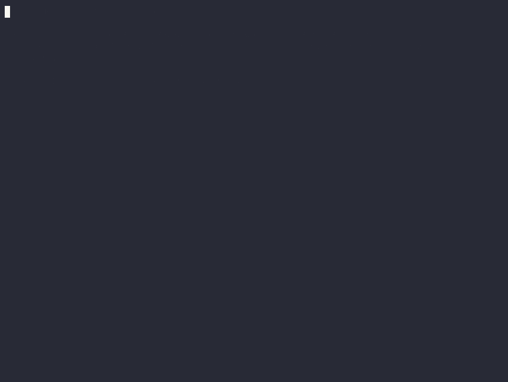
</p>

<p align="center"><em>Plan to shipped in 82 seconds.</em></p>

The same run as a text transcript, for the terminal-shy:

```console
$ alfred demo

Drake         drafts a plan for the missing feature
              approve this plan?  [Y/n] y
Lucius        implements it in an isolated worktree
Ra's al Ghul  reviews the diff, reproduces a planted bug, blocks
Lucius        fixes the bug and adds a regression test
verify        diff applies, sample tests pass
done          change committed with a PR-style summary
```

Four sequential model calls, so it runs at real latency, typically a minute and
a half to two minutes. It never fakes success: a missing CLI, a failed call, an
unchanged worktree, or a failing test stops the run and says so. Full
walkthrough in [`docs/DEMO.md`](docs/DEMO.md).

## Watch the tour

The clip below is about a minute of Alfred working on this repo. It answers a
question about the code, turns a change you describe into a plan you approve, and
scopes the same kind of request from a Slack thread. Its agents then build the
change, review it, and open a pull request.

<p align="center">
  <a href="docs/media/alfred-tour.mp4"></a>
</p>

<p align="center"><em><a href="docs/media/alfred-tour.mp4">Watch the full tour (MP4, 56s)</a>, recorded from <code>alfred serve</code>.</em></p>

## What it is

Alfred is an open-source runtime that gives your local coding CLIs a small,
named team and a shared memory. Your operating system schedules short-lived
agents; each one claims one task, works in an isolated git worktree, and ends in
a real pull request on GitHub. It runs on the Claude Max or Codex Pro
subscription you already pay for, with no API keys and no hosted inference
service.

Alfred never merges its own work by default. A drafted plan waits behind an
approval gate until you approve it, so unapproved work does not ship.

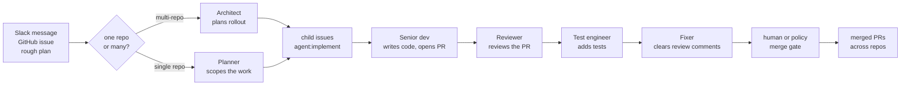

## Screenshots

Alfred's desktop app, and the same UI served in a browser via `alfred serve`,
runs entirely on your machine and is theme-aware. The rest of the screens sit
with the docs they belong to: the Ask surface in
[`CONVERSATION.md`](docs/CONVERSATION.md), guided setup in
[`ONBOARDING.md`](docs/ONBOARDING.md), what Alfred remembers in
[`STATE_AND_MEMORY.md`](docs/STATE_AND_MEMORY.md), and a Slack thread in
[`SLACK_SETUP.md`](docs/SLACK_SETUP.md).

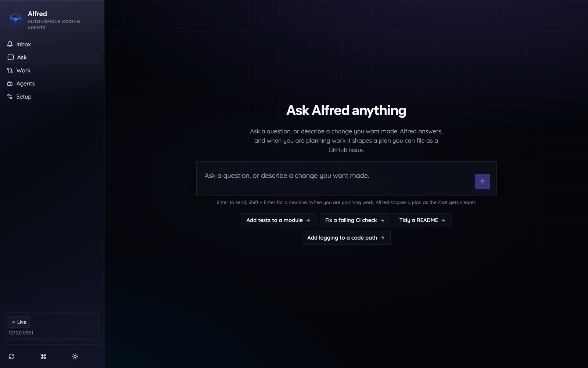

*Ask a question or describe a change; Alfred answers, or shapes a plan you can
file for the fleet to build, review, and ship.*

### The fleet runs on this repo

Alfred runs its own fleet on this repo, `luminik-io/alfred`. It plans, writes,
and reviews changes here and opens pull requests like
[`#528`](https://github.com/luminik-io/alfred/pull/528), a test it wrote and
opened with checks passing. The screenshots below are from those runs.

<table>
  <tr>
    <td width="50%">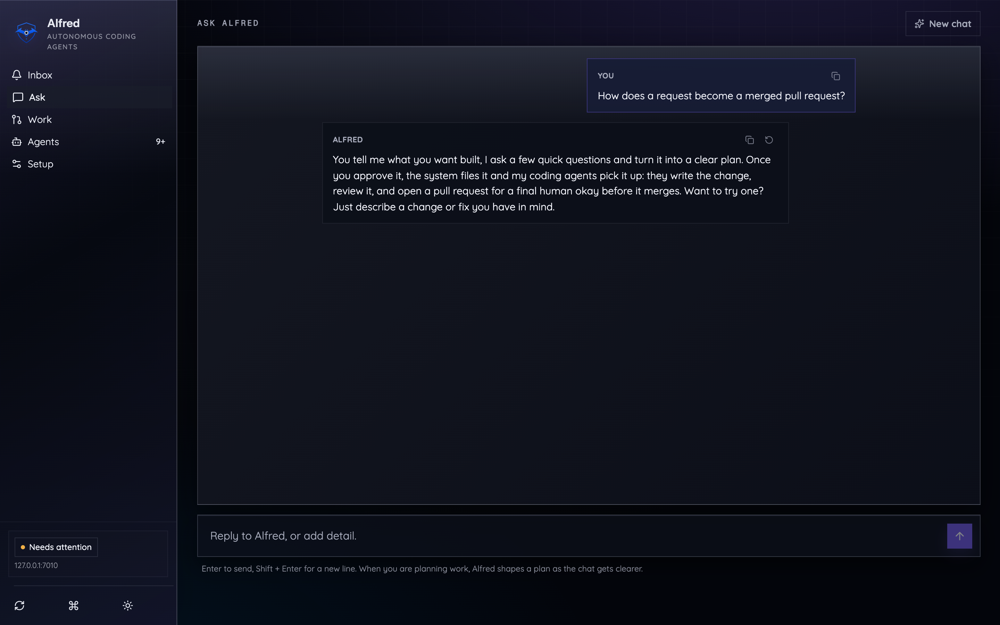<br><sub><em>Ask how work gets done and Alfred explains its own plan, review, and merge loop.</em></sub></td>
    <td width="50%">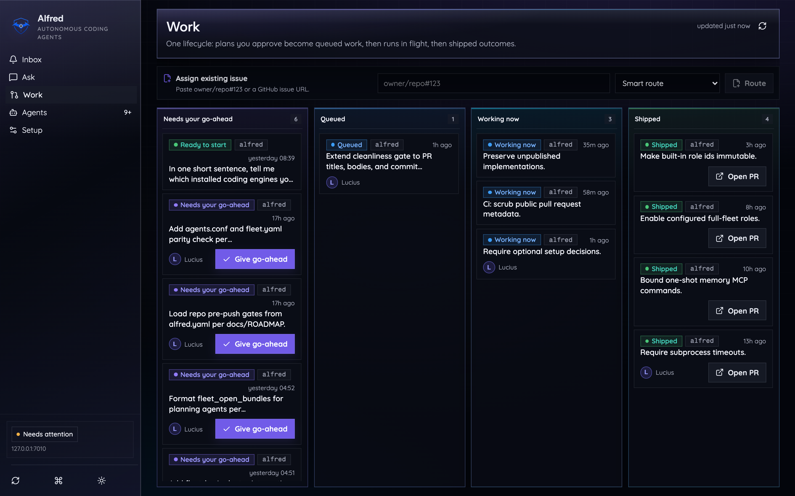<br><sub><em>The work board: runs in flight in <code>Working now</code>, shipped pull requests alongside.</em></sub></td>
  </tr>
  <tr>
    <td width="50%">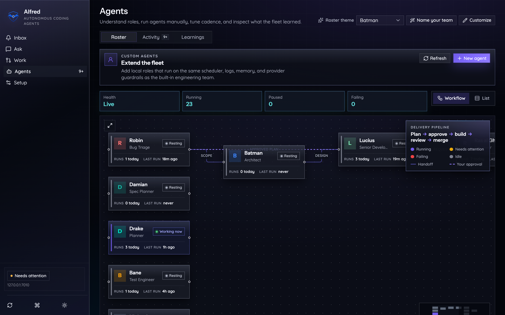<br><sub><em>The workflow graph mid-run, with a planning agent working.</em></sub></td>
    <td width="50%">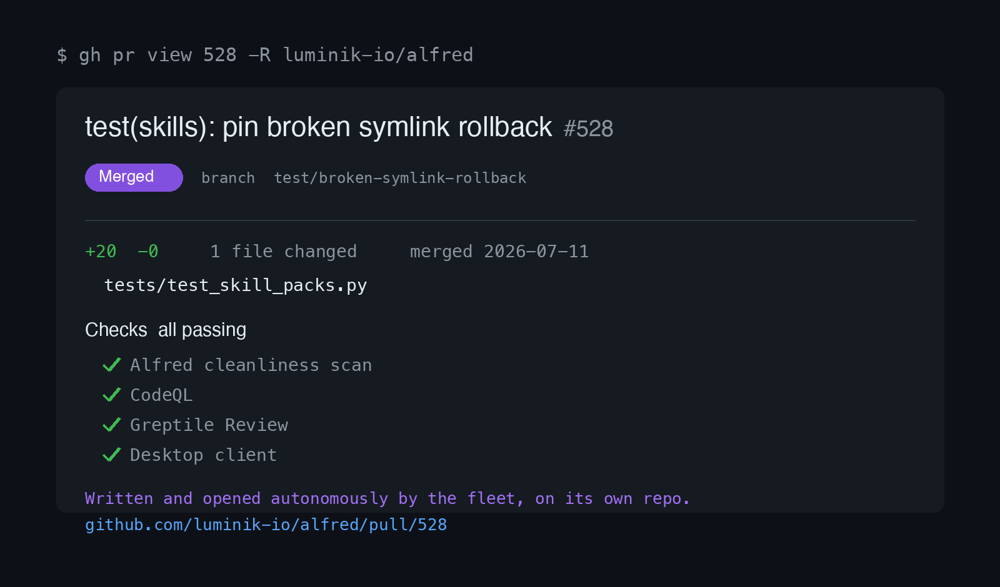<br><sub><em>A real pull request the fleet wrote and opened on its own repo, checks green.</em></sub></td>
  </tr>
</table>

<p align="center">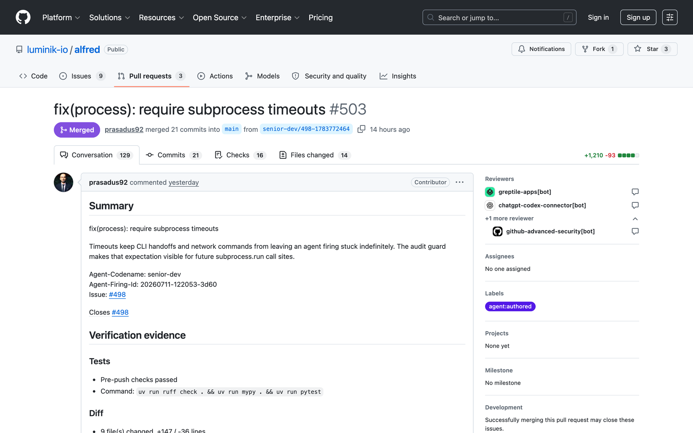</p>

<p align="center"><em>From a one-line seed issue to a merged pull request: <a href="https://github.com/luminik-io/alfred/pull/503"><code>#503</code></a> added the missing subprocess timeouts across the runtime, opened by the fleet off issue <a href="https://github.com/luminik-io/alfred/issues/498"><code>#498</code></a> and driven to a clean review and green checks.</em></p>

Alfred reports back in Slack as it works. Here is one night on this repo: the
planner filing scoped issues, the roster of agents that ran, the pull requests
they opened and merged, and the lessons the memory system kept for next time.

<table>
  <tr>
    <td width="50%">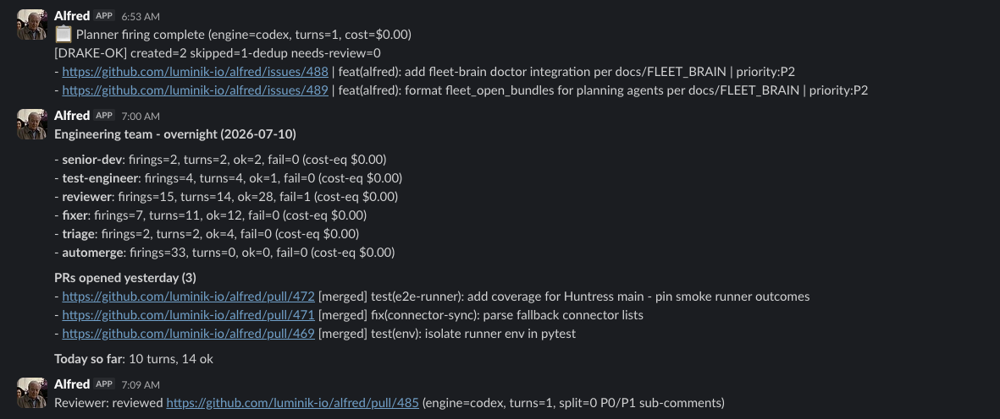<br><sub><em>An overnight run: the planner files scoped issues, and the agent roster opens and merges the pull requests that follow.</em></sub></td>
    <td width="50%">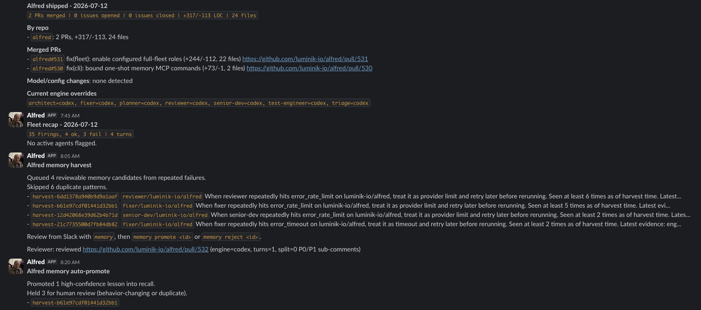<br><sub><em>The daily summary: what merged, how the fleet ran, and the lessons the memory system saved for next time.</em></sub></td>
  </tr>
</table>

## Quick start

The signed desktop app is the recommended way in. It bundles the Alfred core
runtime, installs or repairs the local CLI and agents on first launch, and opens
a guided setup wizard. Prefer the terminal? The headless CLI install is right
below it.

Budget about 30 minutes on a dev machine that already has GitHub auth, Claude
Code, a package manager, and Python. A fresh laptop or a small always-on box is
closer to 60 to 120 minutes, because browser auth and Slack setup take real
time.

The fastest look, though, is the two-minute demo, and it needs none of that
setup.

### One command (fastest demo)

One line lands Alfred on your machine and points you straight at the demo. It
detects your OS, checks prerequisites with plain-language guidance for anything
missing, and clones the repo to `~/alfred`:

```sh
curl -fsSL https://raw.githubusercontent.com/luminik-io/alfred/main/get.sh | sh
```

Then run the demo. It asks nothing of you but an authenticated `claude` CLI,
no GitHub, no Slack, no tokens:

```sh
cd ~/alfred
./bin/alfred demo
```

The installer is idempotent, re-running it updates the checkout in place.
Override the target directory with `ALFRED_CHECKOUT=/path`, or set
`ALFRED_RUN_INSTALL=1` to have it run the full `install.sh` after cloning.

**Platform notes.** macOS on Apple silicon is the primary target and the only
one with a signed, notarized app. macOS on Intel runs Alfred and the demo the
same way, from source; there is no signed Intel binary. Linux schedules the
fleet with `systemd --user` timers, covered in
[`docs/LINUX.md`](docs/LINUX.md). None of the platform specifics touch the demo,
which only needs the clone above plus `claude`.

### Desktop app (recommended)

On first launch, the app's **Install or repair** action lays down Alfred core,
seeds the full built-in team, deploys the local CLI and agents into `~/.alfred`,
installs the starter skills, and starts `alfred serve`. The wizard then walks
through GitHub, engine, repo scope, team naming, and optional Slack.

```sh
brew tap luminik-io/alfred https://github.com/luminik-io/alfred
brew install --cask alfred-os    # signed, notarized macOS app, pulls in the CLI
```

- macOS 11+ on Apple silicon: download the signed, notarized DMG from
  [`alfred.luminik.io/download/`](https://alfred.luminik.io/download/).
- Linux: download the AppImage or `.deb` from the same page.
- Local development: `cd clients/desktop && npm install && npm run tauri dev`.

The app talks to the local runtime over `alfred serve`. That same command also
serves the desktop UI in a browser, so you can open it at
`http://127.0.0.1:7010/` without the native window:

```sh
alfred serve --port 7010 --no-browser
```

### CLI only (headless)

Driving everything from the terminal? Install the CLI on its own.

```sh
brew tap luminik-io/alfred https://github.com/luminik-io/alfred
brew install alfred-os
alfred-install
gh auth login                     # GitHub
claude auth login                 # Claude Code auth
alfred-init                       # choose agents, repos, schedule, and Slack
```

Working from `main` or on Linux, use the source checkout instead:

```sh
git clone https://github.com/luminik-io/alfred.git ~/code/alfred
cd ~/code/alfred
bash install.sh
gh auth login
claude auth login
./bin/alfred-init.py              # choose agents, repos, schedule, and Slack
```

For an unattended install an AI coding tool can drive, pass an explicit repo
list rather than letting it guess:

```sh
./bin/alfred-init.py \
  --non-interactive \
  --agents all \
  --repos your-org/api,your-org/web \
  --slack-webhook skip
```

`alfred-init.py` seeds prompt templates, creates the standard GitHub labels on
the repos you chose, writes the scheduler manifest (`launchd/agents.conf`),
updates `$ALFRED_HOME/.env`, then runs deploy and doctor. The `--repos` owner
must match `GH_ORG`. Full setup with AWS IAM-per-agent and Slack is in
[`BOOTSTRAP.md`](BOOTSTRAP.md); from-zero install and troubleshooting are in
[`INSTALL.md`](INSTALL.md); the Linux `systemd --user` path is in
[`docs/LINUX.md`](docs/LINUX.md).

### Check the wiring

Verify the machine before you trust scheduled work:

```sh
alfred auth status
alfred doctor
alfred dry-run senior-dev
```

Dry-run resolves the role, prints the steps a run would take, and touches
nothing: no scheduler, GitHub, Slack, engine, or files. See
[`docs/DRY_RUN.md`](docs/DRY_RUN.md).

## What's in the box

### The team and workflow

Each agent has one narrow job and coordinates through ordinary GitHub
primitives: issues, pull requests, labels, and isolated worktrees. Review is a
separate step, run by a different agent than the one who wrote the code.

- **Request to reviewed PR, end to end.** The planner scopes a request into
  `agent:implement` issues, the senior developer claims one and opens a PR, the
  reviewer reviews it, the fixer clears high-priority comments, and the test
  engineer adds coverage. Automerge lands only the small, safe PRs your policy
  allows.
- **Single repo or many.** The architect role turns one approved multi-repo
  feature into scoped child issues filed across repos, then the same roles carry
  each one through a reviewed PR.
- **Slack as the planning surface.** Trusted users start requests, refine plans
  in a thread, approve larger work, ask for status, and pause or resume agents,
  all with no shell. Replies after a PR link are captured as context, never as
  merge approval.
- **Verification evidence on every PR.** Each agent PR carries a
  `## Verification evidence` block so a non-author can check the work: the
  pre-push check summary, a diff summary, the acceptance criteria restated
  against the diff, and optional before/after screenshots for UI work. On by
  default; set `ALFRED_PR_EVIDENCE=0` to turn it off. Screenshots are governed
  separately by per-repo config. See [`docs/VERIFICATION.md`](docs/VERIFICATION.md).
- **Your own scheduled roles.** `alfred agent add` creates a runtime agent with
  a custom name, prompt, engine, schedule, and repo scope; deploy renders it into
  the same launchd or systemd schedule as the built-in team.

### Memory

- **The team remembers between runs.** Before a run, an agent recalls the
  lessons earlier runs learned: a repo convention, a fix that worked, a mistake
  not to repeat. After a run, it files new ones when it learned something
  durable. The next run starts from that instead of from zero.
- **Promotion is automatic, and inspectable.** Structural gates and an LLM judge
  decide what becomes durable context, so the queue does not need a human
  babysitting every candidate. You can still inspect or override it from Slack or
  the desktop app.
- **Local by default.** Recalled lessons live in an embedded SQLite hybrid
  store; the operational ledger and review queue live in local FleetBrain.
  Redis Agent Memory remains an opt-in scale battery. See
  [`docs/MEMORY_PROVIDERS.md`](docs/MEMORY_PROVIDERS.md).
- **Measured, not asserted.** A reproducible A/B ran the same suite (10 tasks
  that re-tempt a repo convention the fleet already learned, plus 2 controls)
  through the `claude` CLI twice, changing only whether memory was on. It
  measures one thing: whether the agent repeats a mistake the fleet already
  learned about. Without memory it repeated a known mistake on 8 of the 10
  convention tasks (80%); with memory, 0 of 10 (0%). Overall task success across
  all 12 tasks went from 8.3% (1/12) to 91.7% (11/12), and the memory arm used
  fewer tokens (240,235 vs 294,652). Engine: `claude` CLI. Caveat: synthetic
  fixture, N=10 (+2 controls), single engine run. Method and repro in
  [`docs/BENCHMARKS.md`](docs/BENCHMARKS.md#harder-fixture-result-engineclaude-n10).

### Reliability and safety

- **Approval gate.** A drafted single-repo plan waits behind
  `agent:plan-pending-approval` until you approve it. Alfred never merges its own
  work by default: a human or your merge policy lands each PR.
- **Contained runs.** One run is one short-lived process in one isolated
  worktree, bounded by a hard per-agent daily spend cap. When a Claude-backed
  agent hits a provider limit, every other agent skips for an hour.
- **Failure isolation.** Because the OS scheduler fires a fresh process each
  time, one bad run cannot trash the others, and the fleet survives a reboot. A
  disk guardian pauses agents cleanly when the disk is nearly full.
- **Route engines by role.** Run implementation on Claude Code and review on
  Codex, or keep Claude primary with Codex as fallback for selected agents.

### Surfaces

- **CLI.** `alfred` drives everything: `status`, `doctor`, `enable` / `disable`
  a role, `pause` / `resume` / `run`, `telemetry`, `memory doctor`, `brain`,
  `code-map`, `spec`, `engine`, and more.
- **`alfred serve`.** A local JSON API on loopback that backs the desktop app and
  is scriptable on its own.
- **Desktop app.** One React app in two shells, a Tauri native window and the
  browser via `alfred serve`, with Inbox, Ask, Work, Code, Agents, and Settings
  surfaces.
  Inbox carries a live Claude and Codex subscription usage rail (read from the
  engines' own local CLI state, no billing API).
- **Slack.** The planning and control surface, with trusted commands and
  in-thread progress. Slack never bypasses the approval gates.

## Proof

Alfred runs the Luminik engineering team every day. This is a real daily Slack
summary it posts after a batch of runs: PRs merged, issues opened and closed, and
lines changed across the repos it works.

<p align="center">
  
</p>

Alfred reports anonymous aggregate counts (PRs opened, merged, reviewed, file
deltas) to a public [Impact](https://alfred.luminik.io/impact/) counter. It is on
by default, sends lifetime totals plus a rolling 30-day window, and never sends
repo names, paths, code, prompts, branches, people, or hostnames. A reporting
failure never breaks a run.

```sh
alfred telemetry off      # opt out (or set ALFRED_TELEMETRY_ENABLED=0)
alfred telemetry status   # see local state
```

The Impact page also carries a **self-proof** stat: the cumulative, all-time
count of merged PRs shipped by Alfred agents, with the rolling 30-day window
kept as a secondary line. It is computed from GitHub attribution, never
fabricated. The cumulative total is the truthful measure of total impact, so it
does not read as 0 when the fleet is paused or the window happens to be empty.
Alfred's own public repo proof line is generated the same way:

<!-- SELF_PROOF -->Alfred agents have merged 3 agent-attributed PRs in this repo so far, 3 in the last 30 days<!-- /SELF_PROOF -->.

The line between the markers is refreshed from live GitHub data by
`npm run proof:update` in [`site/`](site/), never hand-typed. If the repo has
activity but no PRs carrying Alfred provenance labels yet, it says so rather than
inventing a traction number.

```sh
# Fleet-wide, from the CLI (self repo + $ALFRED_SHIPPED_REPOS by default):
alfred shipped --self-proof                       # human-readable, per repo + aggregate
alfred shipped --self-proof --json                # machine-readable

# For the public site's Impact page (also refreshes the README line above):
cd site && npm run proof:update
```

The public counter only moves for a trusted reporter token, so a random install
cannot inflate it. You can self-host the collector (a Cloudflare Worker under
[`telemetry/worker/`](telemetry/worker/)). Full contract:
[`docs/TELEMETRY.md`](docs/TELEMETRY.md).

## Roles and themes

Alfred keys everything off a **role**: PR titles, commit-trailer metadata,
scheduler labels, GitHub labels, and worktree paths all use the role slug. A
theme only supplies the display names shown in Slack and the desktop app, so you
can rename the team or pick a theme without touching any of the machinery.

The default full team ships these roles:

- `planner` scopes a request into small `agent:implement` tasks.
- `senior-dev` writes the code and opens the pull request.
- `reviewer` reviews it, as a second agent, not the one who wrote it.
- `test-engineer` adds the tests.
- `fixer` clears the high-priority review comments.
- `architect` plans multi-repo work, waits for approval, and files scoped child
  issues.
- `triage`, `e2e-runner`, and `ops-watch` round out the fleet, with automerge,
  cleanup, memory harvest and promotion, code-map refresh, and the reporting and
  doctor jobs.

Narrow scopes force design quality: "what does the test engineer do?" is a
sharper question when the role has a single job. The desktop app ships Batman,
Transformers, and Justice League presets, and you can author custom names by hand
or by chatting with the theme builder. The default `batman` theme names the roles
after the Gotham cast: `architect` shows as Batman, `senior-dev` as Lucius,
`planner` as Drake, `reviewer` as Ra's al Ghul, `test-engineer` as Bane, and
`fixer` as Nightwing. Themes are display identity only; the runtime still claims
and logs work as `senior-dev`. See
[Identity and themes](docs/IDENTITY_AND_THEMES.md).

## How it works

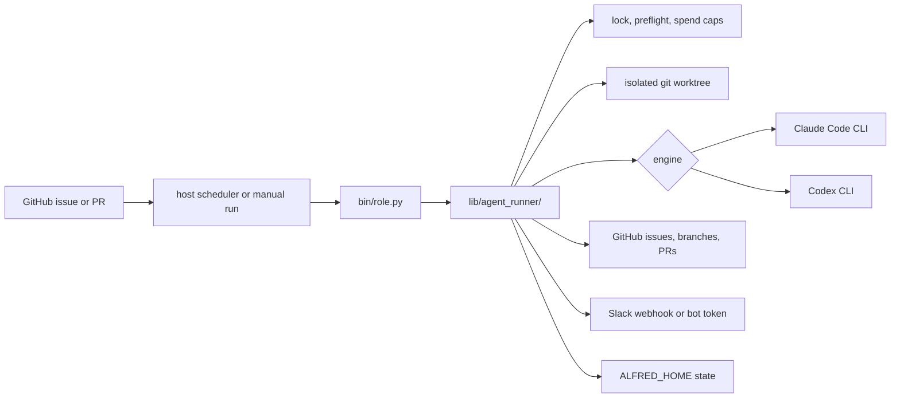

The OS scheduler fires `bin/<role>.py` on a cadence. The `agent_runner` module
wraps each run in a lock, preflight, spend cap, and an isolated worktree, then
`claude -p` (or `codex exec`) does the bounded model work in a subprocess. The
framework code never touches the model directly: the runner is plain Python; the
model writes the code. `ALFRED_HOME` (`~/.alfred` by default) is the runtime
root, where deployed scripts, state, logs, prompt overrides, and worktrees live.
Full rationale in [`ARCHITECTURE.md`](ARCHITECTURE.md).

## Design boundaries

Alfred has a deliberate shape. These boundaries are intentional, and
scope-broadening changes get declined.

- **Single install.** One operator or small team, one Mac or Linux box, one
  config. Not multi-tenant, not a hosted SaaS. Alfred is software you install and
  run yourself.
- **The OS schedules; Alfred runs.** No long-running orchestration loop.
  `launchd` and `systemd --user` own cadence; each run is a fresh, isolated
  process, which is what gives you failure isolation and reboot survival.
- **Local CLI auth, not a model gateway.** Alfred shells out to `claude` and
  optional `codex` on your own subscription-backed auth. There is no hosted
  inference service and no provider API key setup.
- **Lean on the platform.** When Anthropic ships a capability natively (Agent
  Teams, the Memory Tool), Alfred adopts it rather than re-implementing it.
- **Browser automation is per-role.** A role that needs a browser installs
  Playwright in its own script; the core stays lean.

The engineering team, local memory, first-party skills, conversational
onboarding, roster themes, `alfred serve`, and the signed macOS desktop app plus
Linux packages all ship today. Content, sales, and ops departments are the next
larger surface: [`ROADMAP.md`](ROADMAP.md).

## Privacy: what Alfred touches, and what it does not

Alfred touches your repos, your git history, and optionally Slack, so what it can
reach should be obvious. It runs as you, on your machine, against the local CLIs
you already authenticated, and it is meant to be inspectable before it runs.

**What Alfred touches:**

- The repos you explicitly added to `$ALFRED_HOME/.env`, and the isolated
  worktrees it creates for them under `ALFRED_HOME`.
- Your local `claude` and optional `codex` CLI auth, by shelling out to those
  tools. It reads no provider password and stores no API key.
- Four network destinations, and only these four: the model provider you chose
  (Anthropic for Claude Code, OpenAI for Codex), GitHub through `gh`, your Slack
  webhook if you configured one, and the anonymous usage beacon. The beacon is on
  by default, sends aggregate counts only, never code, names, paths, or prompts,
  and turns off with `alfred telemetry off`.

**What Alfred does not do:**

- It does not send your code, file paths, repo names, prompts, branches, or diffs
  anywhere except the model provider you chose and GitHub, as above.
- It does not read repos you did not add, or discover and clone other
  repositories.
- It does not call any third-party analytics, ad, or tracking service.
- It does not request screen recording, accessibility control, your contacts,
  location, microphone, or camera. See
  [`docs/MACOS_PERMISSIONS.md`](docs/MACOS_PERMISSIONS.md).
- It does not merge its own work by default. A human merges. See the
  [threat model](docs/THREAT_MODEL.md).

### Open audit issue

The privacy claim is meant to be tested in the open. Run a network monitor during
a run and confirm the only outbound destinations are the four above. Spot an
undocumented network call, a claim that does not match the code, or a containment
boundary that can be bypassed? Open a
[Security or privacy audit finding](https://github.com/luminik-io/alfred/issues/new?template=audit.yml).
Exploitable vulnerabilities go through a private
[security advisory](https://github.com/luminik-io/alfred/security/advisories/new);
see [`SECURITY.md`](SECURITY.md).

## Repository map

| Path | What it is |
|---|---|
| [`lib/agent_runner/`](lib/agent_runner/__init__.py) | Shared runner library: preflight, lock, spend, `claude_invoke`, `codex_invoke`, `gh`, Slack, event log, commit trailers, the issue claim state machine, worktree recovery, runtime memory, and the dry-run seam. |
| [`bin/alfred`](bin/alfred) | The Alfred CLI. |
| [`bin/`](bin/) | Role runners and local helpers, including the `doctor.sh` implementation behind `alfred doctor`. |
| [`lib/architect_lifecycle.py`](lib/architect_lifecycle.py) | Architect primitives: parent-plan parsing, approval, child issue filing, and bundle labels. |
| [`lib/slack_surface/control.py`](lib/slack_surface/control.py), [`lib/slack_surface/trust.py`](lib/slack_surface/trust.py) | Trusted Slack control and query commands, validated, no shell, with local collaborator state. |
| [`launchd/`](launchd/), [`systemd/`](systemd/) | Schedule templates and `render.sh` (TSV to units) for the macOS and Linux paths. |
| [`deploy.sh`](deploy.sh) | Sync `lib/` and `bin/` into `$ALFRED_HOME` and render the schedule. |
| [`get.sh`](get.sh) | One-command remote installer for `curl \| sh`: preflight, clone to `~/alfred`, then point at `alfred demo`. Idempotent. |
| [`install.sh`](install.sh) | Fresh-machine bootstrap for macOS or Debian/Ubuntu. Idempotent. |
| [`telemetry/worker/`](telemetry/worker/) | Cloudflare Worker for the aggregate counter, also self-hostable. |
| [`examples/bin/`](examples/bin/) | Reference agents: `hello.py` (minimum) and `echo_summarise.py` (full lifecycle). |
| [`clients/desktop/`](clients/desktop/) | The desktop client: one React app, Tauri native and browser shells. |
| [`site/`](site/) | Astro Starlight docs site and the public marketing pages. |

## Documentation

- [Install](INSTALL.md) and [Install tiers](docs/INSTALL_TIERS.md): `core`
  (headless), recommended `client` (desktop), optional `slack`.
- [AI-assisted install](docs/AI_ASSISTED_INSTALL.md): a copy-paste prompt and
  guardrails for driving setup with Claude Code or Codex.
- [Setting Alfred up](docs/ONBOARDING.md): the chat and stepped-form setup paths,
  the action allowlist, the approval gate, and the theme builder.
- [Identity and themes](docs/IDENTITY_AND_THEMES.md): roles are the canonical
  identity; themes supply display names.
- [Workspace patterns](docs/WORKSPACE_PATTERNS.md): one-repo, multi-repo,
  specs-led, and architect layouts.
- [Specs-driven development](docs/SPECS_DRIVEN_DEVELOPMENT.md) and the
  [plain-words version](docs/SPEC_DRIVEN_FOR_EVERYONE.md).
- [Bootstrap](BOOTSTRAP.md): operations guide (AWS IAM, Slack, troubleshooting).
- [Tutorial](docs/TUTORIAL.md): build your first agent end to end.
- [Dry-run mode](docs/DRY_RUN.md) and the [threat model](docs/THREAT_MODEL.md).
- [Architecture](ARCHITECTURE.md) and the
  [architecture diagrams](docs/ARCHITECTURE.md).
- [State machine](docs/STATE_MACHINE.md): the issue lifecycle labels.
- [Memory](docs/MEMORY_PROVIDERS.md) and [MCP servers](docs/MCP.md).
- [Alfred Desktop](docs/DESKTOP_CLIENT.md) and the
  [analytics CLIs](docs/CLI.md).
- [Claude Code and Codex](docs/CLAUDE_CODE.md) and the
  [Codex provider](docs/CODEX_PROVIDER.md).
- [Slack setup](docs/SLACK_SETUP.md), [AWS setup](docs/AWS_SETUP.md), and
  [Linux](docs/LINUX.md).
- [Telemetry](docs/TELEMETRY.md), [Integrations](docs/INTEGRATIONS.md), and
  [macOS permissions](docs/MACOS_PERMISSIONS.md).
- [Contributing](CONTRIBUTING.md) | [Roadmap](ROADMAP.md) |
  [Changelog](CHANGELOG.md) | [Security](SECURITY.md) |
  [Release checklist](docs/RELEASE_CHECKLIST.md).

Rendered docs: https://alfred.luminik.io/.

## Status

**Latest release: v0.6.0.** Alfred ships a local coding-agent team for single
operators and small teams. In the box today:

- Install, full-team setup, prompt seeding, GitHub label setup, specs-assisted
  workspace patterns, doctor, dry-run, code-memory readiness, and starter skills.
- Conversational setup: assemble and name your team by chatting, build a full
  roster theme from a description, and let Alfred run the guided install, all
  through the same allowlisted, approval-gated actions as the form-based flow.
- A stable role identity (`architect`, `senior-dev`, `reviewer`, `test-engineer`)
  with themes layered on top, so renaming your team never changes how the
  runtime, scheduler, or GitHub labels behave.
- Coding-fleet memory that works with nothing extra to run: the default store is
  a single embedded SQLite file (keyword plus optional vector recall), so there
  is no daemon for the common case. Redis Agent Memory and Postgres/pgvector stay
  supported as opt-in scale tiers.
- Optional [batteries](docs/BATTERIES.md): a shared manifest, an
  `alfred batteries` command, and a picker in the desktop onboarding to turn
  extras (stronger compression, the code-structure memory server, dense
  embeddings, Redis or Postgres memory) on or off. Alfred runs fully with none.
- Token-efficient runs by default: verbose tool output is compacted, large files
  are read structure-first with targeted follow-ups, and only the lessons that
  matter are injected, ranked and trimmed to a budget.
- macOS launchd or Linux systemd scheduling, Claude and Codex engine routing,
  and isolated worktree execution, with a single-repo approval gate, multi-repo
  architect planning through `agent:large-feature`, a disk guardian, FleetBrain
  reliability tooling, and a self-grading rubric gate before implementation PRs.
- A signed macOS desktop app and Linux packages (Tauri), with live Claude and
  Codex subscription usage, setup chat, team-theme chat, and repair buttons for
  missing local capabilities.
- Slack-native reporting and a planning path that turns an approved draft into a
  labeled GitHub issue, one-command setup-token bootstrap, and a public download
  page.

See [CHANGELOG.md](CHANGELOG.md) and [ROADMAP.md](ROADMAP.md) for the full
ledger. PRs are welcome when they strengthen the shape above: reliability, setup,
docs, tests, new roles with clear scope, or optional integrations that fail
cleanly. Bigger shifts, such as a new department or a runtime change, should
start as a discussion.

## License

Code is licensed under the MIT License, see [`LICENSE`](LICENSE). Copyright (c)
2026 DataRavel Inc. (dba Luminik), https://www.luminik.io.

Documentation and website content are licensed under CC BY 4.0, see
[`LICENSE-docs`](LICENSE-docs).

"Alfred" and "Luminik" are trademarks of DataRavel Inc., see
[`TRADEMARK`](TRADEMARK.md).

Alfred is named after Alfred Pennyworth: the calm system that keeps the cave
running while the mission is in flight.
