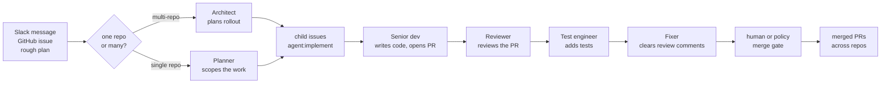

# Alfred

<p align="center">
  
</p>

[](https://github.com/luminik-io/alfred/actions/workflows/ci.yml)
[](https://alfred.luminik.io/)
[](LICENSE)


**Turn Claude Code and Codex into an engineering team that remembers.**

Alfred gives your local coding CLIs a small, named team and a memory. Named
agents plan the work, write the code, review each other, and open pull requests.
When a run learns something durable, it also teaches the fleet and keeps it: a
repo convention, a fix that worked, a mistake not to repeat. The next run starts
from what earlier runs learned instead of from zero.

The team is deliberately small and legible. Each agent has a **role** (its
canonical identity) and a display **name** from the theme you pick. The default
`batman` theme names them after the Gotham cast, shown in parentheses below:

- The **planner** (Drake) turns your plans into scoped tasks.
- The **senior developer** (Lucius) writes the code and opens pull requests.
- The **reviewer** (Ra's al Ghul) reviews them, as a second agent, not the one
  who wrote them.
- The **test engineer** (Bane) adds the tests.
- The **fixer** (Nightwing) clears the review comments.
- The **architect** (Batman) handles multi-repo work: it plans large features,
  waits for approval, and files scoped child issues. The other roles and the
  merge gate carry those child issues through reviewed PRs.

You can rename the whole team, or invent your own, without changing any of the
machinery underneath. See [Identity and themes](docs/IDENTITY_AND_THEMES.md).

Alfred never merges its own work unless you let it. A drafted plan waits behind
an approval gate until you approve it, so unapproved work does not ship.

**It runs on the Claude Max or Codex Pro subscription you already pay for. No API
keys, no separate token bill.** Alfred shells out to your local `claude` and
optional `codex` CLI auth. There is no hosted inference service and no provider
key setup.



### Why Alfred

- **The fleet remembers between runs.** Before a run, an agent recalls the
  lessons earlier runs learned; after a run, it files new ones when it learned
  something durable. Alfred keeps
  those lessons in a local memory (Redis Agent Memory for the semantic lessons,
  a local FleetBrain ledger for the review queue and failure history), so the
  fleet stops rediscovering the same repo conventions and re-making the same
  mistakes. See [Memory](docs/MEMORY_PROVIDERS.md).
- **Named roles and a real second opinion.** The team is small and each agent
  has one job. Ra's al Ghul reviews the code a different agent wrote, so review
  is a separate step, not the author grading their own work. Narrow scopes keep
  the fleet's Slack channel and PR history easy to follow.
- **An approval gate that refuses unapproved work.** A drafted single-repo plan
  waits behind an approval gate (`agent:plan-pending-approval`) until you approve
  it, and Alfred never merges its own work by default. This is a team you
  supervise, not autonomy you hope for. Each run is also contained in an isolated
  worktree and bounded by a hard spend cap.
- **Pull requests are the artifact.** Every run ends in a real PR on GitHub you
  can read, diff, and merge, not a chat transcript or a hidden change. The
  review, the tests, and the history are all where your team already looks.
- **Local and private by construction.** Alfred runs as you, on your own Mac,
  against the CLIs you already authenticated. Alfred does not send code to
  Alfred or Luminik servers. Task context goes only to the model provider you
  chose, GitHub, and Slack when you configured Slack.
- **Public proof is generated, not hand-typed.** Alfred's own repo proof line is
  refreshed from strict GitHub attribution:
  <!-- SELF_PROOF -->No public agent-attributed PRs in Alfred's own repo in the last 30 days yet<!-- /SELF_PROOF -->.
  The line between the markers is generated from live GitHub data by
  `npm run proof:update` from [`site/`](site/) (the same command that refreshes
  the Impact page JSON), never hand-typed. If the public repo has activity but
  no PRs carrying Alfred provenance labels yet, it says that instead of
  inventing a traction number. See [Anonymous usage totals](#anonymous-usage-totals).

Docs site: https://alfred.luminik.io

## See it in one run: `alfred demo`

Before you install anything against your own repos, watch the whole loop once
on a throwaway sample project. The only thing you need is an authenticated
`claude` CLI (the Claude subscription you already pay for). No GitHub, no
Slack, no tokens.

```sh
alfred demo          # installed
./bin/alfred demo    # from a source checkout
```

It copies a tiny bundled sample repo into a temp dir, then runs a compressed
pipeline of real `claude` calls against it and streams the story to your
terminal:

- **Drake** drafts a plan for a missing feature.
- You approve it at a real gate (press Enter, or type `n` to decline).
- **Lucius** implements it in an isolated git worktree.
- **Ra's al Ghul** reviews it and catches a real bug planted in the sample,
  verified with an actual reproduction before blocking.
- **Lucius** fixes the bug and adds a regression test.
- The change is verified (real diff, sample tests pass), then committed
  locally with a pull-request-style summary.

Four real, sequential model calls, so it is bounded by real latency rather
than a canned script: expect roughly two to three minutes, and the closing
line reports your run's actual measured time. It never fakes success: a
missing CLI, a failed call, an unchanged worktree, or a failing test suite
stops the run honestly. Full walkthrough and flags in
[`docs/DEMO.md`](docs/DEMO.md).

## Privacy: what Alfred touches, and what it does not

Alfred touches your repos, your git history, and optionally Slack, so what it can
reach should be obvious. It runs as you, on your machine, against the local CLIs
you already authenticated. It is meant to be inspectable, so you can read exactly what will happen before it runs.

**What Alfred touches:**

- The repos you explicitly added to `$ALFRED_HOME/.env`, and the isolated worktrees it
  creates for them under `ALFRED_HOME` (`~/.alfred` by default).
- Your local `claude` and optional `codex` CLI auth, by shelling out to those
  tools. It reads no provider password and stores no API key.
- Four network destinations, and only these four: the model provider you chose
  (Anthropic for Claude Code, OpenAI for Codex), GitHub through `gh`, your
  Slack webhook if you configured one, and the anonymous usage beacon at
  `alfred-proof-telemetry.luminik.workers.dev/ingest`. The beacon is on by
  default, sends aggregate counts (lifetime plus a rolling 30-day window) and
  a little reporter-status metadata, never code, names, paths, or prompts,
  and you can turn it off any time with `alfred telemetry off`. See
  [Anonymous usage totals](#anonymous-usage-totals).

**What Alfred does NOT do:**

- It does **not** send your code, file paths, repo names, prompts, branches, or
  diffs anywhere except the model provider you chose and GitHub, as above.
- It does **not** read repos you did not add. It does not discover or clone other
  repositories.
- It does **not** call any third-party analytics, ad, or tracking service.
- It does **not** turn on usage reporting silently against your private
  data. Anonymous aggregate counts are the only thing reported, they never
  include code, names, paths, or prompts, and you can turn them off with
  `alfred telemetry off`. See [Anonymous usage totals](#anonymous-usage-totals).
- It does **not** request screen recording, accessibility control, your contacts,
  your location, your microphone, or your camera. See
  [`docs/MACOS_PERMISSIONS.md`](docs/MACOS_PERMISSIONS.md).
- It does **not** merge its own work by default. A human merges; see the
  [threat model](docs/THREAT_MODEL.md).

Want to verify it yourself? Run a network monitor during a firing and confirm the
only outbound destinations are the four above (the telemetry beacon fires on a
stock install until you run `alfred telemetry off`). Find an undocumented call?
That is what the [open audit issue](#open-audit-issue) is for.

- [macOS permissions explainer](docs/MACOS_PERMISSIONS.md): every prompt you may
  see, why it appears, and the long list of permissions Alfred never requests.
- [Threat model](docs/THREAT_MODEL.md): what one run can and cannot do, isolated
  worktrees, the approval gate, and never auto-merge.
- [Telemetry contract](docs/TELEMETRY.md): exactly what an anonymous count
  contains, and the off switch.

### Open audit issue

For a tool that touches repos, git, and Slack, the privacy claim is meant to be
tested in the open. If you spot an undocumented network call, a privacy claim
that does not match the code, or a containment boundary that can be bypassed,
open a
[Security or privacy audit finding](https://github.com/luminik-io/alfred/issues/new?template=audit.yml).
Exploitable vulnerabilities go through a private
[security advisory](https://github.com/luminik-io/alfred/security/advisories/new)
instead; see [`SECURITY.md`](SECURITY.md).

## Why use it

Interactive coding agents finish one prompt while you sit at the keyboard, and
each session forgets what the last one learned. Alfred is for the engineering
work that should keep moving after you step away, handled by a team that carries
its lessons forward: planned features, reviewer comments, follow-up tests,
dependency bumps, docs gaps, and multi-repo rollouts.

- **Narrow, single-purpose roles.** Planner plans, Lucius implements, Ra's al
  Ghul reviews, Bane adds tests, Nightwing clears review comments, and Batman
  turns approved multi-repo rollouts into repo-sized work.
- **Coordinate through ordinary repo primitives.** Issues, pull requests, labels,
  specs, isolated worktrees, commit trailers, and Slack summaries. The desktop
  app (native or in a browser via `alfred serve`) reads the same local state and
  GitHub records.
- **Add your own scheduled roles.** `alfred agent add` creates
  operator-defined runtime agents with custom names, prompts, engines, schedules,
  and repo scope; deploy renders them into the same launchd/systemd fleet.
- **Treat Slack as the planning surface.** Teammates reply in a plan thread with
  scope changes, questions, and acceptance criteria while you keep approval
  authority. Replies after a PR link are captured as context, never as merge
  approval.
- **Run the fleet conversationally from Slack.** Trusted control commands
  (`status`, `runs`, `plans`, `pause`, `resume`, `memory ...`, and more) inspect
  and steer local state with no shell. When the issue bridge is enabled, an
  approved draft becomes a labeled GitHub issue and in-thread posts report
  progress as the fleet works it. A plain-language intake profile lets a
  non-technical user approve outcomes instead of code.
- **Route engines by role.** Run implementation on Claude Code and review on
  Codex, or keep Claude as primary with Codex fallback for selected agents.
- **Bring your own subscription.** Alfred shells out to your local `claude` and
  optional `codex` CLI auth. It does not bill LLM calls separately or require
  provider API keys.
- **Keep autonomy bounded.** One firing, one worktree, one IAM scope, one Slack
  report, hard spend caps, and an explicit GitHub state machine. A drafted
  single-repo issue waits behind an approval gate (`agent:plan-pending-approval`)
  until you approve it.

Default single-repo flow: request, plan, spec, or issue -> Drake files scoped
`agent:implement` issues -> senior-dev claims one and opens a worktree -> Claude Code
or Codex implements -> a PR opens with `agent:authored` -> Ra's al Ghul reviews
-> Nightwing fixes P0/P1 comments -> Bane adds tests -> Automerge lands the small
safe PRs you allow -> Slack reports what changed.

Every agent PR carries a `## Verification evidence` block so a non-author can
check the work at a glance: the pre-push check summary the runner already ran,
a diff summary, the issue's acceptance criteria restated with the engine's
self-assessment of its own diff, and optional before/after screenshots for UI
work. Evidence that could not be generated says so rather than being omitted.
This is on by default (`ALFRED_PR_EVIDENCE=1`); screenshots are opt-in per repo.
See [`docs/VERIFICATION.md`](docs/VERIFICATION.md).

Multi-repo flow is public OSS code, not an internal-only path. The `architect`
role, shown as Batman in the default theme, owns `agent:large-feature`: one
parent issue in `ARCHITECT_PARENT_REPO` can become an approved rollout, with
scoped child `agent:implement` issues filed across repos after the approval gate
you choose. Fresh Desktop installs the full fleet from the start, but the
architect role stays idle until you configure the parent repo and arm it with
`alfred enable architect`. From there, senior-dev implements, reviewer reviews,
test-engineer adds focused tests, fixer handles high-priority review comments,
and your merge policy or a human lands each PR. When the architect files every
child successfully, it removes the parent's `agent:large-feature` queue label,
adds `architect:fanout-complete`, and closes the parent so the same bundle
cannot fan out twice without counting the planning parent as shipped work.
Per-child PR completion rollups remain the next architect iteration.

## Quick start

The signed desktop app is the recommended way to install. It bundles the Alfred
core runtime, installs or repairs the local CLI and agents on first launch, and
opens straight into a guided setup wizard. Prefer the command line? The
headless CLI install is right below it.

Budget about 30 minutes on a dev machine that already has GitHub auth, Claude
Code, a package manager, and Python ready. A fresh laptop, Mac mini, old Mac, or
Linux box is closer to 60 to 120 minutes because browser auth and Slack setup
take real time.

### Install Alfred Desktop (recommended)

The desktop app is the front door. On first launch its **Install or repair**
action installs Alfred core, seeds the full built-in fleet, deploys the local
CLI/agents into `~/.alfred`, installs the first-party starter skills, attempts
the pinned code-memory doctor, and starts `alfred serve`. The guided setup then
walks through GitHub, engine, repo scope, roster naming, and optional Slack.
Advanced checks such as doctor, dry-run, memory, skills, and code graph status
are available in Setup.

```sh
brew tap luminik-io/alfred https://github.com/luminik-io/alfred
brew install --cask alfred-os    # signed, notarized macOS app, pulls in the CLI
```

- macOS 11+ on Apple silicon: download the signed, notarized DMG from
  [`alfred.luminik.io/download/`](https://alfred.luminik.io/download/).
- Linux: download the AppImage or `.deb` from the same page.
- Direct downloads include the desktop app plus bundled Alfred core resources.
  Setup's **Install or repair** action lays down the runtime before starting it.
- Local development: `cd clients/desktop && npm install && npm run tauri dev`.

The app connects to the local runtime over `alfred serve`. Start the local API
manually if you want, or let the setup wizard install/repair core and start it
for you:

```sh
alfred serve --port 7010 --no-browser
```

`alfred serve` also serves the desktop app in the browser, so you can open the
same UI at `http://127.0.0.1:7010/` without the native window. Drop
`--no-browser` to have it open a tab for you.

### Install the CLI only (headless)

Prefer a headless box or want to drive everything from the terminal without the
GUI? Install the CLI on its own.

macOS Homebrew path:

```sh
brew tap luminik-io/alfred https://github.com/luminik-io/alfred
brew install alfred-os
alfred-install
gh auth login                     # GitHub
claude auth login                 # Claude Code auth
alfred-init                       # choose repos, team names, schedule, Slack
```

Source checkout path, for working from `main` or running the Linux installer:

```sh
git clone https://github.com/luminik-io/alfred.git ~/code/alfred
cd ~/code/alfred
bash install.sh
gh auth login                     # GitHub
claude auth login                 # Claude Code auth
./bin/alfred-init.py              # choose repos, team names, schedule, Slack
```

The Homebrew formula installs the latest tagged release and exposes
`alfred`, `alfred-init`, `alfred-install`, `alfred-deploy`, and
`alfred doctor` on your PATH.

For a solo-builder setup that an AI coding tool can run without guessing at
prompts or labels, pass one repo or an explicit comma-separated repo list:

```sh
./bin/alfred-init.py \
  --non-interactive \
  --agents all \
  --repos your-org/api,your-org/web \
  --slack-webhook skip
```

The full fleet includes `planner` (Drake), `architect` (Batman), `senior-dev`
(Lucius), `reviewer` (Ra's al Ghul), `test-engineer` (Bane), `fixer`
(Nightwing), `triage` (Robin), `e2e-runner` (Huntress), `ops-watch` (Gordon),
automerge, `agent-cleanup`, memory harvest, memory auto-promotion,
`code-map-refresh`, morning briefs, recaps, shipped summaries, and fleet doctor.
Slack is optional. The `--repos` owner must match `GH_ORG`;
the runtime agents store the bare repo name in `$ALFRED_HOME/.env` and build
`GH_ORG/repo` at firing time. `alfred-init.py` seeds prompt templates, creates
the standard GitHub labels on selected repos, writes the scheduler manifest
(`launchd/agents.conf`), updates `$ALFRED_HOME/.env`, then runs deploy and doctor.

The full fleet is installed and visible from the start. High-impact lanes still
have explicit gates: Batman is the default-theme name for `architect`, and that
role waits behind the runner gate until `alfred enable architect`. It still needs
its approval mode before filing child issues. Huntress and Gordon are the
default-theme names for `e2e-runner` and `ops-watch`; those roles also load from
day one and self-idle until their target URL or ECS cluster exists.

You can add a local role without writing a new runner:

```sh
alfred agent add release-captain \
  --display-name "Release Captain" \
  --role-title "Release coordinator" \
  --prompt "Review release readiness and summarize blockers for the operator." \
  --engine hybrid \
  --schedule 30m \
  --repo your-org/api

bash deploy.sh
```

For a framework-only developer checkout with no scheduled agents configured,
use `bash deploy.sh && ./bin/alfred doctor`; doctor reports `0 passed, 0
failed`. This is only for Alfred framework work. Normal users should install
the full fleet above. To add a bespoke local role later, see
[`examples/bin/echo_summarise.py`](examples/bin/echo_summarise.py), the small
role built in [the tutorial](docs/TUTORIAL.md), or
[`examples/bin/hello.py`](examples/bin/hello.py) for the absolute minimum.

Full setup including AWS IAM-per-agent, Slack webhook, and your first scheduled firing: [`BOOTSTRAP.md`](BOOTSTRAP.md). From-zero install with troubleshooting: [`INSTALL.md`](INSTALL.md). On Linux, see [`docs/LINUX.md`](docs/LINUX.md) for the `systemd --user` path.

Want Claude Code, Codex, or another local coding assistant to drive setup for
you? Use [`docs/AI_ASSISTED_INSTALL.md`](docs/AI_ASSISTED_INSTALL.md). It gives
the assistant a copy-paste prompt, explicit repo-scope lanes, and the guardrails
that prevent it from assigning every repo or inventing secrets. For checkout
layout choices, use [`docs/WORKSPACE_PATTERNS.md`](docs/WORKSPACE_PATTERNS.md).

### Check setup

Use doctor and dry-run to verify the machine before trusting scheduled work:

```sh
alfred auth status
alfred doctor
alfred dry-run senior-dev
```

Dry-run is a diagnostic path. It resolves the canonical role slug and prints the
run steps without touching the scheduler, GitHub, Slack, engines, or local
files. See
[`docs/DRY_RUN.md`](docs/DRY_RUN.md) for the exact boundary.

## System shape


One firing is one short-lived process. The OS scheduler controls cadence, the
runner applies safety rails, and the LLM CLI only receives the bounded task.

## Design notes

Many agent harnesses assume one long-running process, in-memory state, and a
human at a prompt. That is the wrong shape for unattended engineering work:

- Long-running loops have no failure isolation. One bad run trashes the others.
- In-memory state can't survive an OS reboot. A long-lived host restarts every few weeks.
- Chat-first interfaces keep you on the critical path.

Alfred inverts that:

- The host scheduler fires `bin/<role>.py` every N minutes. Each firing is a
  fresh, short-lived process.
- The `agent_runner` module wraps each firing in a lock, preflight, spend cap,
  and isolated worktree, then `claude -p` (or `codex exec`) does the bounded LLM
  work in a subprocess.
- Spend is tracked per agent per day. When a Claude-backed agent hits a provider
  limit, every other agent skips for an hour.
- The framework code never touches the LLM directly. The runner is plain Python;
  the model writes the code.

The [System shape](#system-shape) diagram traces one firing end to end;
[`ARCHITECTURE.md`](ARCHITECTURE.md) has the full rationale.

## Runtime boundary

Alfred core does not install or run an external agent gateway, hosted memory
database, skill registry, or dashboard service. The fleet works with local
Python scripts, `gh`, `git`, configured LLM CLIs, a loopback Redis Agent Memory
Server for recalled lessons, and FleetBrain for the local review and reliability
ledger.

`ALFRED_HOME` is the runtime root. A fresh install defaults to `~/.alfred`,
where deployed scripts, state, logs, Codex artifacts, prompt overrides, and
worktrees live. Alfred uses `ALFRED_HOME` only for its runtime path.

Companion layers can be useful around Alfred, but they must not be required for
a clean OSS install unless the installer starts and verifies them locally. See
[`docs/INTEGRATIONS.md`](docs/INTEGRATIONS.md) for the boundary.

Alfred provides the repeatable local fleet pattern: schedules, worktrees, issue
claims, PR loops, Slack reporting, and failure guards. Today it supports Claude
Code CLI and Codex CLI adapters. Other engines require a wrapper binary or new
adapter code.

## Anonymous usage totals

Alfred reports anonymous aggregate counts (PRs opened, merged, reviewed, file
deltas) to a public [Impact](https://alfred.luminik.io/impact/) counter. It is on
by default. Alongside the lifetime totals it sends a rolling 30-day window of
the same counts and a little reporter-status metadata (which counts are stale).
It never sends repo names, paths, code, prompts, branches, people, or hostnames.
A reporting failure never breaks a firing.

```sh
alfred telemetry off      # opt out (or set ALFRED_TELEMETRY_ENABLED=0)
alfred telemetry status   # see local state
```

The Impact page also carries a **self-proof** stat: the share of merged PRs, in
a configured repo set over a rolling window, that were shipped by Alfred agents
(the Aider "wrote its own code" pattern). It is computed from GitHub, never
fabricated: an empty window reports "no merged PRs yet" rather than a 0% share.
Refresh or preview it from either surface:

```sh
# Fleet-wide, from the CLI (self repo + $ALFRED_SHIPPED_REPOS by default):
alfred shipped --self-proof                       # human-readable, per repo + aggregate
alfred shipped --self-proof --json                # machine-readable
alfred shipped --self-proof --self-proof-json proof.json   # write JSON for a badge/page
alfred shipped --period weekly                    # the weekly Slack recap now carries the line

# For the public site's Impact page (refreshes site/src/data/impact-proof.json
# AND the README self-proof line between the SELF_PROOF markers):
cd site && npm run proof:update                   # writes summary + self_proof block, updates README
```

The weekly recap appends one self-proof line automatically; the daily recap
stays lean unless you pass `--with-self-proof`.

The public counter only moves for a trusted reporter token, so a random install
cannot inflate it. Self-host the collector (Cloudflare Worker under
[`telemetry/worker/`](telemetry/worker/)): deploy it with `wrangler deploy`,
point Alfred at it with `alfred telemetry on --url ... --token ...`, then load
the reporter into the host scheduler with `alfred-deploy` (Homebrew install) or
`bash deploy.sh` (source checkout). Full contract:
[`docs/TELEMETRY.md`](docs/TELEMETRY.md).

## What's in here

| Path | What it is |
|---|---|
| [`lib/agent_runner/`](lib/agent_runner/__init__.py) | Shared library (package; public API re-exported from `__init__.py`). Preflight, lock, spend, claude_invoke, codex_invoke, gh, slack, event-log, commit-trailer, handoff-table, issue claim state machine, runner gate helpers, dedup helpers (`find_open_authored_pr_for_issue`, `reuse_or_make_worktree`), worktree recovery refs, runtime memory, slack severity routing, dry-run seam. |
| [`lib/slack_format.py`](lib/slack_format.py) | Block Kit + bot-token Slack helpers: per-firing `firing_thread_root` / `firing_thread_reply` / `firing_thread_close`. Severity colour stripes. |
| [`lib/architect_lifecycle.py`](lib/architect_lifecycle.py) | Architect lifecycle primitives for parent-plan parsing, approval, child issue filing, reporting, and bundle labels. |
| [`lib/planning_assistant.py`](lib/planning_assistant.py) | Shared issue/spec refinement helpers for `alfred serve`, `alfred spec refine`, and Slack plan amendments. |
| [`lib/scheduler.py`](lib/scheduler.py) | Host-scheduler abstraction: `launchd` on macOS, `systemd --user` on Linux, behind one interface. |
| [`bin/alfred`](bin/alfred) | Alfred CLI: `alfred agents`, `alfred status`, `alfred doctor`, `alfred enable <role-slug>`, `alfred disable <role-slug>`, `alfred pause` / `resume` / `run`, `alfred clear-lock`, `alfred telemetry status/on/off`, `alfred brain ...`, `alfred memory doctor`, `alfred code-map export/summary/impact`, `alfred mcp serve`, `alfred spec ...`, `alfred labels bootstrap/check`, `alfred engine status/set`, `alfred claude status/primary/secondary/swap/probe`, `alfred codex status/probe`, `alfred auth status/probe`. |
| [`bin/custom-agent.py`](bin/custom-agent.py), [`lib/custom_agents.py`](lib/custom_agents.py) | Operator-defined runtime agents from `$ALFRED_HOME/state/custom-agents/custom-agents.json`. `alfred agent add` writes the manifest; deploy renders enabled rows into launchd/systemd; the read-only default runner uses normal Alfred locks, preflight, events, spend, memory, and engine routing. |
| [`bin/alfred-usage.py`](bin/alfred-usage.py) | Live Claude + Codex subscription usage for the rolling 5-hour and weekly limit windows, read from the engines' own local CLI state (no billing API). The same data is served over the live `GET /api/usage` endpoint; this is its `alfred usage` CLI front end. |
| [`bin/alfred-shipped-summary.py`](bin/alfred-shipped-summary.py) | Daily/weekly shipped-work report across configured repos: merged PRs, issues, LOC, and model/config changes. Also available as `alfred shipped`. |
| [`bin/shipped-summary-daily.sh`](bin/shipped-summary-daily.sh), [`bin/shipped-summary-weekly.sh`](bin/shipped-summary-weekly.sh) | Launchd wrappers for scheduled shipped-work Slack reports. |
| [`bin/architect.py`](bin/architect.py) | The `architect` role's runner (Batman in the default theme) for cross-repo work. It reads `agent:large-feature` parent issues from `ARCHITECT_PARENT_REPO`, applies approved repo-scope amendments, files scoped child `agent:implement` issues, and carries approved thread notes into those issues when `ARCHITECT_AUTO_EXECUTE` allows it. |
| [`bin/fleet-doctor.py`](bin/fleet-doctor.py) | Daily fleet-health snapshot. Read-only checks (paused repos, global block, stale worktrees, runner gate list) → severity-stripe Slack thread. |
| [`bin/memory-harvest.py`](bin/memory-harvest.py) | Optional scheduled memory-harvest wrapper. Queues reviewable repeated-failure candidates and nudges Slack when there is something to review. |
| [`bin/proof-telemetry.py`](bin/proof-telemetry.py) | Anonymous usage-total reporter. Posts aggregate counts to Alfred's hosted collector by default; `ALFRED_TELEMETRY_ENABLED=0` turns it off; fail-soft. |
| [`telemetry/worker/`](telemetry/worker/) | Cloudflare Worker for Alfred's hosted aggregate counter, also self-hostable for forks and private counters. |
| [`bin/`](bin/) | Local helpers, including the `doctor.sh` implementation behind `alfred doctor`. |
| [`launchd/`](launchd/) | `_template.plist` + `agents.conf.example` + `render.sh` (TSV → plists). |
| [`systemd/`](systemd/) | `_template.service` + `_template.timer` + `render.sh` (TSV → `systemd --user` units) for the Linux path. |
| [`deploy.sh`](deploy.sh) | Sync `lib/` + `bin/` into `${ALFRED_HOME}`. If `launchd/agents.conf` exists, render units and bootstrap the host scheduler; otherwise do a framework-only deploy. |
| [`install.sh`](install.sh) | Fresh-machine bootstrap: Homebrew (macOS) or apt (Debian/Ubuntu) + npm + dirs + shell rc. Idempotent. |
| [`examples/bin/hello.py`](examples/bin/hello.py) | Smallest possible custom role agent: preflight + Slack post. |
| [`examples/bin/echo_summarise.py`](examples/bin/echo_summarise.py) | Full lifecycle reference: pick / claim / claude / act / release / report. |
| [`examples/bin/label_state.py`](examples/bin/label_state.py) | Alfred CLI helper for the issue claim state machine. |
| [`examples/git-hooks/pre-push`](examples/git-hooks/pre-push) | Refuses push if a referenced issue is in-flight. Symmetric guard. |
| [`Formula/alfred-os.rb`](Formula/alfred-os.rb) | Homebrew formula for the CLI, pinned to the latest public release tarball. `brew install alfred-os`. |
| [`Casks/alfred-os.rb`](Casks/alfred-os.rb) | Homebrew cask for the signed native desktop app. `brew install --cask alfred-os`. |
| [`site/`](site/) | Astro Starlight docs site, with GitHub Pages publishing gated by the release repo variable. |
| [`clients/desktop/`](clients/desktop/) | The desktop client: one React app, two shells (a Tauri Mac/Linux native window, and the browser via `alfred serve`). A local dashboard over `alfred serve` JSON APIs, with Inbox, Ask, Work, Agents, and Setup surfaces plus explicit Slack and GitHub external links. Inbox carries a Claude + Codex usage rail (real subscription usage, no billing API; backed by the live `GET /api/usage` endpoint); Agents defaults to a cinematic roster with a list toggle. Builds native installers (`.app`/`.dmg`, `.AppImage`/`.deb`) from the Tauri bundle config. |
| [`lib/slack_control.py`](lib/slack_control.py), [`lib/slack_trust.py`](lib/slack_trust.py) | Trusted Slack control/query commands (`status`/`runs`/`plans`/`plan`/`draft`/`handled`/`memory`/`remember`/`pause`/`resume`/`trusted`/`trust`/`untrust`/`help`), codename-, plan-id-, and memory-id-validated, no shell, with local collaborator state under `$ALFRED_HOME/state/slack-trust`. |
| [`lib/slack_thread_status.py`](lib/slack_thread_status.py), [`bin/alfred-slack-thread-sync.py`](bin/alfred-slack-thread-sync.py) | In-thread fleet progress: read-only issue/PR/CI sweep that posts only the new lifecycle states back to the originating Slack thread. |

## Documentation

- [Install](INSTALL.md): fresh-machine walkthrough.
- [Install tiers](docs/INSTALL_TIERS.md): `core` (standalone, headless), recommended `client` (desktop), optional `slack`.
- [AI-assisted install](docs/AI_ASSISTED_INSTALL.md): copy-paste prompt for Claude Code, Codex, or another local coding assistant.
- [Setting Alfred up](docs/ONBOARDING.md): the two setup paths (chat or stepped form), the onboarding action allowlist, the approval gate, and the theme builder.
- [Identity and themes](docs/IDENTITY_AND_THEMES.md): roles are the canonical identity; themes supply the display names.
- [Workspace patterns](docs/WORKSPACE_PATTERNS.md): one-repo, multi-repo, specs-led, and architect planning layouts.
- [Specs-driven development](docs/SPECS_DRIVEN_DEVELOPMENT.md): how to turn specs into issue queues, architect plans, and reviewable PRs.
- [Spec-driven work in plain words](docs/SPEC_DRIVEN_FOR_EVERYONE.md): the non-technical version. Describe an outcome, answer a question or two, approve a preview.
- [Bootstrap](BOOTSTRAP.md): operations guide (AWS IAM, Slack, troubleshooting).
- [Tutorial: your first agent](docs/TUTORIAL.md): Echo, end-to-end.
- [Dry-run mode](docs/DRY_RUN.md): watch a side-effect-safe firing lifecycle before trusting scheduled work.
- [Architecture](ARCHITECTURE.md): design rationale.
- [Architecture diagrams](docs/ARCHITECTURE.md): mermaid diagrams for the agent lifecycle, model dispatch, locking, the Slack-native flow, the disk guardian, and the layered install.
- [State machine](docs/STATE_MACHINE.md): `agent:in-flight` → `agent:pr-open` → `agent:done` lifecycle.
- [Memory](docs/MEMORY_PROVIDERS.md): Redis Agent Memory for recalled lessons, local FleetBrain for the operational ledger and review queue, Slack-driven memory review, failure history, reliability governor, read-only MCP access, and the stable `alfred-codegraph@1` code-map export.
- [MCP servers](docs/MCP.md): the read-only `alfred_memory` and consumed `code_memory` MCP servers Alfred attaches to Claude-engine firings only (Codex-routed firings get no MCP), per-role tool scoping, the safety model, and configuration.
- [Alfred Desktop](docs/DESKTOP_CLIENT.md): the desktop app tab by tab, the Slack-native boundary, the Claude + Codex usage rail (backed by the live `GET /api/usage` endpoint), the cinematic agent roster, the `alfred serve` API, and building native installers.
- [Alfred analytics CLIs](docs/CLI.md): `alfred metrics`, `alfred logs`, `alfred usage`, and `alfred slack-listener`.
- [Goals](docs/GOALS.md): durable goal contract across Slack, CLI, client, planning readiness, evaluator, and memory.
- [Plain mode](docs/PLAIN_MODE.md): the non-technical intake profile (`ALFRED_INTAKE_PROFILE=plain`).
- [Claude Code and Codex](docs/CLAUDE_CODE.md): install, Pro vs Max, account routing, engine routing.
- [Codex provider](docs/CODEX_PROVIDER.md): Codex engine modes, probe commands, runtime contract, and billing posture.
- [Capability doctor](docs/CAPABILITIES.md): local code graph, context-compression, and skill-pack readiness.
- [Slack setup](docs/SLACK_SETUP.md): webhook + AWS storage + (optional) bot token, planning listener, trusted control commands, the issue bridge, and in-thread fleet-progress thread-sync.
- [AWS setup](docs/AWS_SETUP.md): IAM-per-agent, scoped policies.
- [Skills](docs/SKILLS.md): recommended Claude Code skills.
- [Telemetry](docs/TELEMETRY.md): anonymous aggregate usage totals, the on/off switch, and how to self-host the collector.
- [Integrations](docs/INTEGRATIONS.md): optional companion tools and what Alfred does not bundle.
- [Linux](docs/LINUX.md): Debian/Ubuntu via `systemd --user` timers. Install, deploy, and operate.
- [Publishing](docs/PUBLISHING.md): GitHub Pages, custom-domain, and release-site checks.
- [Contributing](CONTRIBUTING.md) | [Roadmap](ROADMAP.md) | [Changelog](CHANGELOG.md)
- [Security](SECURITY.md): private-disclosure process.
- [Threat model](docs/THREAT_MODEL.md): what one run can and cannot do, the containment boundaries, and inputs treated as untrusted.
- [macOS permissions](docs/MACOS_PERMISSIONS.md): every prompt, why it appears, and what Alfred never requests.
- [Release checklist](docs/RELEASE_CHECKLIST.md): pre-tag gates, scrub scan, GitHub Release flow.

Rendered version: https://alfred.luminik.io/.

## Roles and themes

The framework expects one agent script per narrow specialist, identified by its
**role** and coordinating via labels and gh state rather than in-process calls.
The default full fleet ships these roles, shown here with the name each one
takes in the default `batman` theme:

- `architect` (Batman)
- `senior-dev` (Lucius)
- `planner` (Drake)
- `test-engineer` (Bane)
- `reviewer` (Ra's al Ghul)
- `triage` (Robin)
- `fixer` (Nightwing)
- `e2e-runner` (Huntress)
- `ops-watch` (Gordon)

The role is the canonical identity: PR titles, commit-trailer metadata,
scheduler labels, GitHub labels, and worktree paths all key off it. A theme only
supplies the display names, so a coherent roster makes the fleet's Slack channel
scannable while the machinery stays stable. Narrow scopes force design quality:
"what does Bane do for tests?" is a sharper question than "what does the test
agent do?", while the machine still keys off `test-engineer`.

Pick whatever roster fits. The desktop app ships the Batman, Transformers, and
Justice League presets, and you can author custom names by hand or by chatting
with the theme builder. Roster themes and custom names are display identity
only: they change the names and role labels shown in Agents, onboarding, and
Slack, while roles, scheduler labels, GitHub labels, worktrees, and merge gates
stay unchanged. If you add a new agent script later, the custom roster editor
can name that live agent too.

See [Identity and themes](docs/IDENTITY_AND_THEMES.md) for the full model and
[Role and theme pattern](https://alfred.luminik.io/concepts/codename-pattern/)
for more.

## Design boundaries

Alfred has a deliberate shape. The boundaries below are intentional.

- **Single install.** One person, one Mac or Linux box, one config. Alfred is software you install and run yourself.
- **The OS schedules; Alfred runs.** No long-running orchestration loop. `launchd` / `systemd` own cadence; each firing is a fresh, isolated process. That means better failure isolation, and it survives reboots.
- **Local CLI auth.** Alfred shells out to `claude` and optional `codex` on your own subscription-backed CLI auth. There is no hosted inference service or provider API key setup.
- **Explicit goals and bounded autonomy.** Larger work should have a clear contract: outcome, verification, constraints, human gates, and blocked condition.
- **Lean on the platform.** When Anthropic ships a capability natively (Agent Teams, the Memory Tool), Alfred adopts it rather than re-implementing it.
- **Browser automation is per-role.** If a role needs a browser, it installs Playwright in its own bin script; the core stays lean.

The engineering fleet, local memory, code-memory readiness, first-party skills,
conversational onboarding, roster themes, `alfred serve`, and the signed macOS
desktop app plus Linux desktop packages all ship today. Content, sales, and ops
departments are the next larger surface area: [`ROADMAP.md`](ROADMAP.md).

## Status

**Latest release: v0.5.3.** Alfred ships a local coding-agent fleet for solo
builders. What is in the box today:

- Install, full-fleet setup, prompt seeding, GitHub label setup, specs-assisted
  workspace patterns, doctor, dry-run, code-memory readiness, and starter
  skills.
- macOS launchd or Linux systemd scheduling, Claude/Codex engine routing, Slack
  reporting, and isolated worktree execution.
- A signed macOS desktop app and Linux desktop packages (Tauri), with live Claude
  and Codex subscription usage, AI-native setup chat, team-theme chat, and repair
  buttons for missing local capabilities.
- A single-repo approval gate, multi-repo architect planning through
  `agent:large-feature`, a disk guardian that pauses agents cleanly when the disk
  is nearly full, Redis-backed memory, FleetBrain reliability tooling, and a
  self-grading rubric gate before implementation PRs.
- A Slack planning path that turns an approved draft into a labeled GitHub issue,
  one-command setup-token bootstrap, a public download page, and SEO plus
  consent-gated analytics on the site.

See [CHANGELOG.md](CHANGELOG.md) and [ROADMAP.md](ROADMAP.md) for the full ledger.

The native app has Inbox, Ask, Work, Agents, and Setup surfaces for local trust
and repair. Inbox carries a Claude and Codex usage rail (real subscription usage
from the engines' own local CLI state, no billing API, also available from
`alfred usage`). Agents shows a cinematic roster with a list toggle. Runs emit
step-level events so the timeline shows real progress. Any issue with the approval
gate label (`agent:plan-pending-approval`) is held from autonomous pickup until
you approve it. Slack remains the primary collaboration surface.

The design boundary is stable: one person, one local Mac or Linux box, local
CLIs, isolated worktrees, GitHub as the coordination layer. PRs are welcome when
they strengthen that shape: reliability, setup, docs, tests, new roles with
clear scope, or optional integrations that fail cleanly. Bigger shifts, such as a
new department or runtime change, should start as a discussion.

## License

Code is licensed under the MIT License - see [`LICENSE`](LICENSE). Copyright (c) 2026 DataRavel Inc. (dba Luminik), https://www.luminik.io.

Documentation and website content are licensed under CC BY 4.0 - see [`LICENSE-docs`](LICENSE-docs).

"Alfred" and "Luminik" are trademarks of DataRavel Inc. - see [`TRADEMARK`](TRADEMARK.md).

## Name and theme

Alfred is named after Alfred Pennyworth: the calm system that keeps the cave
running while the mission is in flight. The public repository is
`luminik-io/alfred`, but the product name is Alfred. The default `batman` theme
names the roles after the same cast: the `architect` role shows as Batman, the
`senior-dev` role as Lucius, the `planner` role as Drake, the `reviewer` role as
Ra's al Ghul, the `test-engineer` role as Bane, and the `fixer` role as
Nightwing. You can keep those defaults, switch the visible roster to another
preset, or define custom display names without changing the underlying roles.
