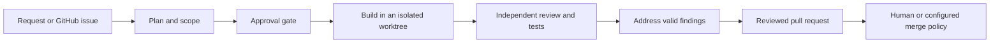
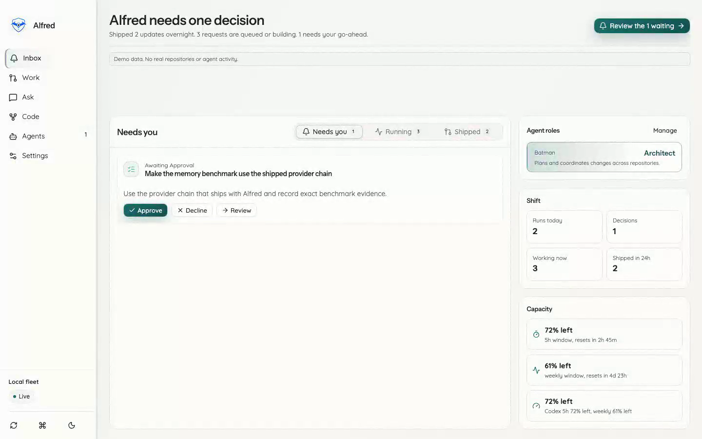
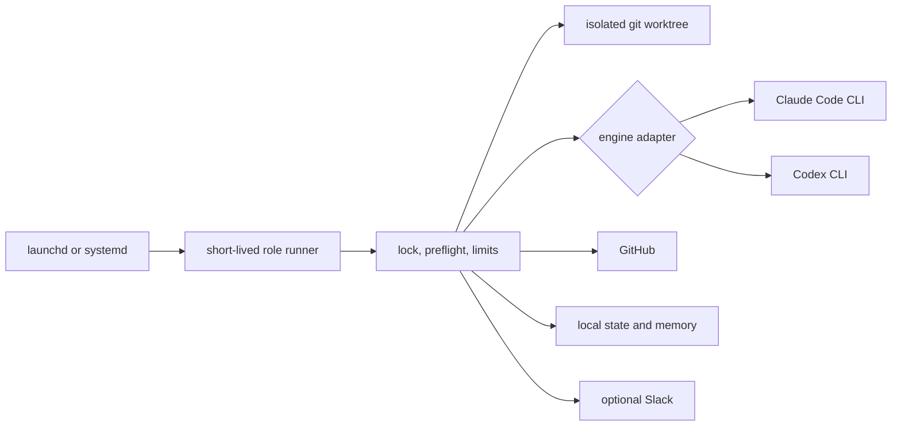

# Alfred

<p align="center">
  
</p>

[](https://github.com/luminik-io/alfred/actions/workflows/ci.yml)
[](https://alfred.luminik.io/)
[](LICENSE)


**An autonomous engineering team that ships while you're away.**

Alfred turns Claude Code and Codex into a spec-driven engineering team. Named
agents plan the work, write code, test it, review each other, and open pull
requests. Alfred keeps working without you at the keyboard. You approve risky
actions and decide what merges.

Interactive coding agents finish one prompt while you sit at the keyboard, then
forget what the last session learned. Alfred is for work that should keep moving
after you step away: planned features, review comments, follow-up tests,
dependency bumps, and multi-repo rollouts. Alfred carries each one to a pull
request you can read, diff, and merge. It remembers what it learned for next
time.

| A coding-harness session | Alfred |
|---|---|
| Handles the prompt in front of you | Claims queued work on a schedule |
| Works in the current checkout | Creates an isolated worktree for code changes and review |
| Keeps session-local context | Recalls reviewed lessons across runs |
| Uses one active harness | Routes roles between Claude Code and Codex |
| Returns an answer or diff | Produces a PR, review findings, tests, and evidence |

Alfred is local-first and open source. It is for solo builders and small teams
that want autonomous work to continue between check-ins while they retain
explicit control over risky actions and merge policy.

## How work moves


```mermaid
flowchart LR
    request["Request or GitHub issue"] --> plan["Plan and scope"]
    plan --> approval["Approval gate"]
    approval --> build["Build in an isolated worktree"]
    build --> review["Independent review and tests"]
    review --> fix["Address valid findings"]
    fix --> pr["Reviewed pull request"]
    pr --> merge["Human or configured merge policy"]
```

Each role has one job. Stable role slugs such as `planner`, `senior-dev`,
`reviewer`, and `test-engineer` control scheduling and GitHub labels. Optional
themes change display names only.

## Run the demo

The demo uses a throwaway repository and an authenticated `claude` CLI. It does
not need GitHub or Slack. The run stops if an engine call, file change, or test
fails.

```sh
curl -fsSL https://raw.githubusercontent.com/luminik-io/alfred/main/get.sh | sh
cd ~/alfred
./bin/alfred demo
```

The demo runs the plan, approval, implementation, review, fix, and verification
stages. See the [demo guide](docs/DEMO.md) or watch the
[fixture-only product tour](docs/media/alfred-tour.mp4).

<p align="center">
  <a href="docs/media/alfred-tour.mp4">
    
  </a>
</p>

## Install

### Desktop app on macOS

The signed desktop app installs or repairs the local runtime and opens guided
setup. macOS on Apple silicon is the primary packaged target.

```sh
brew tap luminik-io/alfred https://github.com/luminik-io/alfred
brew install --cask alfred-os
```

You can also download the signed macOS package or Linux packages from the
[download page](https://alfred.luminik.io/download/).

### Headless CLI

```sh
brew tap luminik-io/alfred https://github.com/luminik-io/alfred
brew install alfred-os
alfred-install
gh auth login
claude auth login
alfred-init
```

For Linux or a source install:

```sh
git clone https://github.com/luminik-io/alfred.git ~/code/alfred
cd ~/code/alfred
bash install.sh
gh auth login
claude auth login
./bin/alfred-init.py
```

For unattended setup, provide the repository scope explicitly:

```sh
./bin/alfred-init.py \
  --non-interactive \
  --agents all \
  --repos your-org/api,your-org/web \
  --slack-webhook skip
```

Then verify the installation before you enable scheduled work:

```sh
alfred auth status
alfred doctor
alfred dry-run senior-dev
```

The dry run resolves the role and checks the lifecycle without calling an
engine or changing GitHub, Slack, git, the scheduler, or project files. See the
[installation guide](INSTALL.md), [Linux guide](docs/LINUX.md), and
[dry-run contract](docs/DRY_RUN.md).

## What ships

### Autonomous engineering workflow

- The planner turns a request into bounded implementation work.
- The architect can split an approved change across several repositories.
- The senior developer implements one issue in one worktree and opens a PR.
- A separate reviewer checks the diff. The test engineer adds coverage.
- The fixer addresses high-priority review findings.
- Agent PRs include verification evidence by default so another person can
  check what ran and what did not.
- Alfred leaves merge authority with a person or an explicit repository policy.

After work enters the queue, the agents continue through implementation,
testing, review, and fixes without waiting for another prompt. Configured
controls stop only the actions that need a decision.

GitHub issues, labels, branches, comments, and pull requests form the shared
coordination layer. Slack is optional. It supports planning, status, and trusted
control commands, but it does not bypass approval gates.

### Local memory and code context

The default recalled-lesson store is embedded SQLite. FleetBrain keeps the
local operational ledger, review queue, failure history, and worker state.
Memory candidates pass structural checks and a confidence review before they
can affect later runs. Operators can inspect, reject, retire, or revert lessons.

Alfred also includes context controls that reduce unnecessary model input:

- Compact successful tool output while retaining full failure output.
- Read large files through structure-first and delta views.
- Rank and trim recalled lessons to a prompt budget.
- Add blast-radius context before a change.
- Offer a pinned, checksum-verified codebase-memory MCP binary after you
  configure an explicit repository scope.

Optional batteries add dense local embeddings, Redis memory, Postgres with
pgvector, Headroom compression, or an alternative graph tool. They remain
inspectable and reversible. See [batteries](docs/BATTERIES.md),
[memory providers](docs/MEMORY_PROVIDERS.md), and
[code memory](docs/CODE_MEMORY.md).

### Local control surfaces

- `alfred` manages setup, health, roles, runs, engines, memory, and logs.
- `alfred serve` provides a loopback JSON API and browser interface.
- The Tauri desktop app uses the same local API.
- Slack provides an optional collaboration surface.

`ALFRED_HOME` defaults to `~/.alfred`. It contains deployed runners, state,
logs, worktrees, and prompt overrides.

## Safety and privacy

Alfred runs with your local user permissions. Repository configuration controls
what Alfred schedules and indexes. It is not a filesystem or network sandbox.

- It schedules work only for repositories you configure.
- Code-changing and review roles use separate worktrees.
- It checks locks, authentication, disk space, and spend limits before engine
  work starts.
- It halts repeated failing runs instead of retrying without a bound.
- It holds planned work behind the configured approval gate.
- It does not merge its own PRs by default.
- It records run events and verification evidence for inspection.

Runtime network use can include the configured model provider, GitHub, Slack,
optional telemetry, and download endpoints for selected batteries. Anonymous
aggregate telemetry is enabled by default and excludes code, prompts, paths,
repository names, branch names, and hostnames. Disable it at any time:

```sh
alfred telemetry off
alfred telemetry status
```

Agents and project tools can make other network calls with your user account's
permissions. Use a dedicated operating-system account, virtual machine, or
container when you need a stronger boundary than repository configuration.

Read the [threat model](docs/THREAT_MODEL.md),
[telemetry contract](docs/TELEMETRY.md), and
[macOS permissions](docs/MACOS_PERMISSIONS.md) before you enable unattended
runs. Report a privacy or containment mismatch with the
[public audit template](https://github.com/luminik-io/alfred/issues/new?template=audit.yml).
Report exploitable vulnerabilities through a private
[security advisory](https://github.com/luminik-io/alfred/security/advisories/new).

## Verification

Alfred uses reproducible tests and public artifacts instead of an adoption
claim. The [memory benchmark](docs/BENCHMARKS.md) reports its fixture,
denominator, engine, provider, and limitations. Stub runs verify the harness but
do not count as engine evidence.

Examples from this repository include [PR #503](https://github.com/luminik-io/alfred/pull/503),
which added subprocess timeouts from a scoped issue, and
[PR #528](https://github.com/luminik-io/alfred/pull/528), which added a test with
green checks.

The [verification contract](docs/VERIFICATION.md) defines what an agent PR
records and how missing evidence appears. The
[telemetry documentation](docs/TELEMETRY.md) defines Alfred's optional
aggregate usage payload.

## Architecture


```mermaid
flowchart LR
    scheduler["launchd or systemd"] --> role["short-lived role runner"]
    role --> controls["lock, preflight, limits"]
    controls --> worktree["isolated git worktree"]
    controls --> engine{"engine adapter"}
    engine --> claude["Claude Code CLI"]
    engine --> codex["Codex CLI"]
    controls --> github["GitHub"]
    controls --> state["local state and memory"]
    controls --> slack["optional Slack"]
```

The host scheduler starts a fresh process for each firing. The shared runner
performs preflight checks, creates or recovers a worktree when the role needs
one, invokes the chosen CLI, records events, and updates GitHub. Alfred does not
run a model gateway or a long-running coordinator. See
[ARCHITECTURE.md](ARCHITECTURE.md).

## Documentation

- [Install](INSTALL.md) and [onboarding](docs/ONBOARDING.md)
- [Architecture](ARCHITECTURE.md) and
  [architecture diagrams](docs/ARCHITECTURE.md)
- [Workspace patterns](docs/WORKSPACE_PATTERNS.md) and
  [spec-driven development](docs/SPECS_DRIVEN_DEVELOPMENT.md)
- [Identity and themes](docs/IDENTITY_AND_THEMES.md)
- [Memory](docs/MEMORY_PROVIDERS.md), [MCP](docs/MCP.md), and
  [batteries](docs/BATTERIES.md)
- [Claude Code and Codex](docs/CLAUDE_CODE.md) and
  [Codex provider](docs/CODEX_PROVIDER.md)
- [Verification](docs/VERIFICATION.md), [security](SECURITY.md), and
  [contributing](CONTRIBUTING.md)
- [Roadmap](ROADMAP.md) and [changelog](CHANGELOG.md)

Rendered documentation: [alfred.luminik.io](https://alfred.luminik.io/).

## Project status

Alfred supports macOS and Linux. Release tags and package downloads are on
[GitHub Releases](https://github.com/luminik-io/alfred/releases). Claude Code
and Codex are the validated execution engines. The [roadmap](ROADMAP.md) lists
active work and future evaluation. The [changelog](CHANGELOG.md) records
shipped changes.

## License

Code is licensed under the [MIT License](LICENSE). Documentation and website
content are licensed under [CC BY 4.0](LICENSE-docs).

Copyright (c) 2026 DataRavel Inc. (dba Luminik).

"Alfred" and "Luminik" are trademarks of DataRavel Inc. See
[TRADEMARK.md](TRADEMARK.md).
