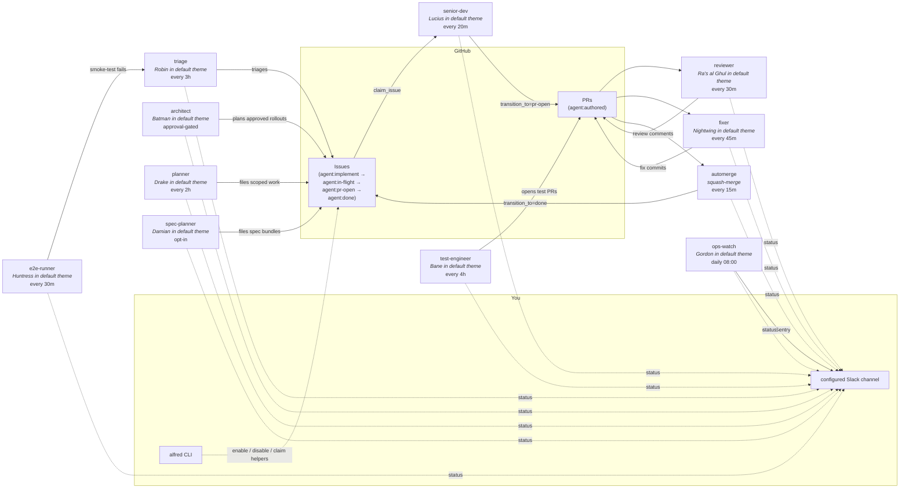
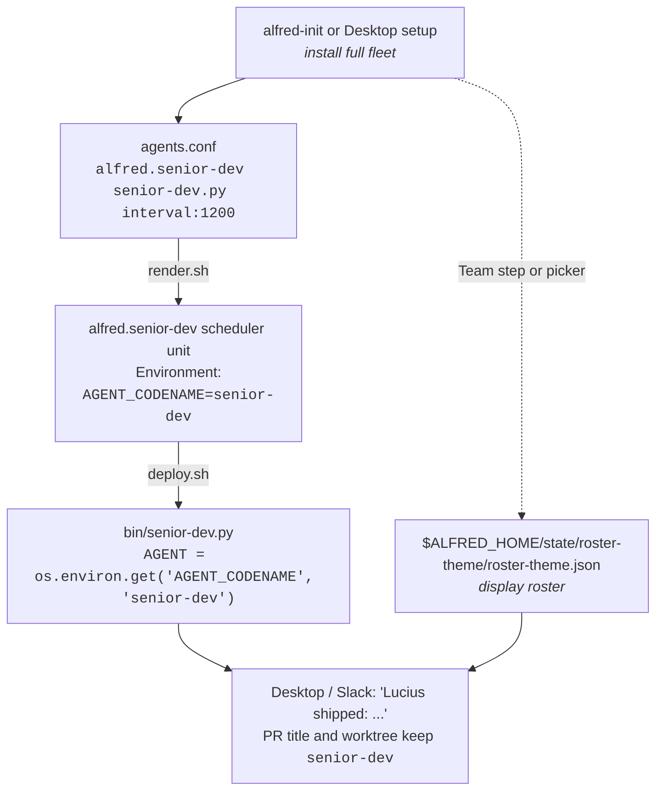

# Agents

The agents shipped in Alfred are engineering-focused. Each is a narrow specialist identified by its **role** (a slug like `senior-dev` or `reviewer`). The role is the canonical identity: scheduler labels, GitHub labels, worktree names, and merge gates all key off it. A **theme** supplies the display names you see; the default `batman` theme names the roles after the Gotham cast (the `senior-dev` role shows as "Lucius", and so on). Alfred Desktop lets you switch to another theme or author custom names without changing any of the machinery. See [Identity and themes](IDENTITY_AND_THEMES.md) for the full model.

## Fleet map



Solid arrows are state transitions (someone modifies the issue or PR). Dashed
arrows are observability (someone reports). You interact through the
`alfred` CLI, Slack, and the optional `examples/bin/label_state.py` helper for
issue-claim overrides.

## Shipped topology (engineering)

The repo ships these agents. Schedules are sensible defaults; override
per-agent in `agents.conf`.

The recommended engineering hierarchy starts with the `architect`, `senior-dev`,
and `planner` roles (Batman, Lucius, and Drake in the default theme): the
architect handles cross-repo features, the senior developer ships repo-local
implementation PRs, and the planner scopes smaller single-repo requests. A full
install configures the whole engineering fleet, including the architect, from
the start. High-impact parent-plan execution stays behind the runner gate and
the approval mode you choose, so a one-repo install can keep the architect
visible without letting it file work until multi-repo or multi-package plans are
ready.

The table below lists each agent by its **role**, which is the runner identity:
the role-slug is the `bin/<slug>.py` script name, the scheduler label, and the
key every GitHub label and worktree path uses. The **name** column is only what
the default `batman` theme shows; switch themes to change it, and the role stays
put.

| Role (runner) | Name (default theme) | Default schedule | Default repos | What it does |
|---|---|---|---|---|
| `architect` (`bin/architect.py`) | Batman | every 1 h, approval-gated | `BATMAN_PARENT_REPO` | Coordinates multi-repo features. Drafts the rollout from parent issues, waits for Slack or Alfred client approval, files child `agent:implement` issues, and reports status so implementation can move in parallel. |
| `senior-dev` (`bin/senior-dev.py`) | Lucius | every 20 min | `ALFRED_SENIOR_DEV_REPOS` | Picks the oldest open `agent:implement` issue, claims it via the state machine, opens a worktree, runs `claude -p` with the issue body + repo context, pushes a PR labelled `agent:authored`. |
| `planner` (`bin/planner.py`) | Drake | every 2 h | all in-scope repos | Reads specs / roadmap / `IMMEDIATE_NEXT_STEPS` / cross-repo open-issue list / code-reality grep. Files the next well-scoped `agent:implement` issue. Caps at 5 issues per firing, 20 in rolling 24 h. |
| `spec-planner` (`bin/spec-planner.py`) | Damian | daily 09:00, opt-in | `DAMIAN_SCAN_REPOS` | Reads `DAMIAN_SPEC_DIR` end-to-end, identifies multi-repo features, files `agent:bundle:<slug>` siblings across affected repos. All-or-nothing per bundle. Caps at 3 bundles per firing. Single-repo work is left to the planner. Prompt seeded from `prompts/spec-bundle-planner.md`. |
| `test-engineer` (`bin/test-engineer.py`) | Bane | every 4 h | `ALFRED_TEST_ENGINEER_REPOS` (round-robin) | Picks the lowest-coverage actively-changed file. Writes tests. Opens PR. |
| `reviewer` (`bin/reviewer.py`) | Ra's al Ghul | every 30 min | all in-scope repos | Multi-axis review (correctness, security, perf, maintainability) on every fresh PR. Posts as comment. |
| `fixer` (`bin/fixer.py`) | Nightwing | every 45 min | all `agent:authored` PRs | Lands fixes for P0 / P1 reviewer comments (CodeRabbit, Codex, the reviewer) on agent-authored PRs. |
| `triage` (`bin/triage.py`) | Robin | every 3 h | all in-scope repos | Classifies new bug-report issues. Adds severity labels, asks for repro info, hands off to the senior-dev role via `agent:implement`. Has a local touched-issues ledger so it doesn't re-triage. |
| `e2e-runner` (`bin/e2e-runner.py`) | Huntress | every 30 min | staging only | Runs Playwright smoke tests against `ALFRED_E2E_RUNNER_TARGET_URL`. Reports failures with screenshots. |
| `ops-watch` (`bin/ops-watch.py`) | Gordon | daily 08:00 | ECS + Sentry | Diffs ECS staging task-def image SHA against repo `main` HEAD; pulls top-5 unresolved Sentry issues from the last 24 h. Quiet on healthy days, Slack-posts on drift / Sentry signal. Read-only. |
| `automerge` (`bin/automerge.py`) | Auto-merge | every 15 min | all `agent:authored` PRs | Squash-merges PRs that pass: 30 min age, CI green, no unresolved P0 reviewer comments, latest reviewer comment ends "Ship-ready: yes". Never touches non-`agent:authored` PRs. |
| `agent-cleanup` (`bin/agent-cleanup.py`) | Agent cleanup | daily 03:00 | n/a | Sweeps stale `/tmp/<agent>-debug-*`, abandoned worktrees, expired spend files, expired transcripts, stuck locks (>4h), stale `agent:in-flight` claims (>4h via `force_release_stale_claim`). |
| `code-map-refresh` (`bin/code-map-refresh.py`) | Code map | every 6 h | `ALFRED_CODE_MAP_REPOS` | Scans configured repos and writes `${ALFRED_HOME}/state/code-map.json` with source files, symbols, imports, API calls, server routes, and contract drift. The planner, architect, and code-map-aware review prompts can read it for cross-repo context. |
| `agent-morning-brief` (`bin/agent-morning-brief.py`) | Morning brief | daily 07:00 | n/a | Slack post: yesterday's PRs shipped, in-flight work, doctor status, anything red. |
| `fleet-recap` (`bin/fleet-recap.sh`) | Fleet recap | 07:30 + 22:00 | n/a | Two scheduled runs of the same script (labelled `fleet-recap-morning` and `fleet-recap-evening`). Aggregates per-agent spend / runs / success rate. Posts to Slack. |
| `alfred-nightly` (`bin/alfred-nightly.py`) | Nightly | weekly Sun 22:00, opt-in | `ALFRED_NIGHTLY_NPM_REPOS`, `ALFRED_NIGHTLY_ADVISORY_REPOS` | Weekly dependency updater. Applies safe-band npm bumps (caret-compatible, pre-push verified) and opens one PR per npm repo; gradle/pip repos get an advisory-only Slack report, never a PR. Major bumps and CVEs are surfaced but not auto-merged. A no-op until the repo lists are set. |
| `cold-backup` (`bin/alfred-cold-backup.py`) | Cold backup | weekly Sun 04:00, opt-in | `ALFRED_BACKUP_DEST` | Archives `$ALFRED_HOME/state`, the cron store, and the runtime plists, uploads the tarball to an S3 prefix, and prunes to a retention window. `--local-only` skips S3. A no-op until a destination is set. |

## Roster customization

The role-slug is the machine identity. It appears in PR titles, commit-trailer metadata, log filenames, worktree paths, and the host scheduler label or unit. The visible roster name is the human identity, supplied by the active theme. Alfred Desktop can apply preset themes or custom names and role labels across the desktop and Slack while the role stays stable. The full identity model is in [Identity and themes](IDENTITY_AND_THEMES.md).

### Why the defaults are Batman

Two reasons:

1. **Operational legibility.** A coherent fictional cast makes scanning the Slack channel faster than `agent-1 / agent-2 / agent-3` or `feature-dev / test-coverage / review`. Once you've worked with Lucius for a week, "Lucius failed on #303" is instantly readable.
2. **Design forcing function.** "What does *Bane* do?" is a sharper question than "what does the test agent do?". Naming the role after a *character* (who has a personality, a domain, a relationship to other characters) forces narrow scope per role.

### Picking your own visible roster

If you want a different visible roster, use Alfred Desktop's Team step or Agents roster picker, or build one by chatting with the theme builder (see [Setting Alfred up](ONBOARDING.md)). Pick something coherent. Some examples:

- **Greek pantheon**: Athena (planner), Hephaestus (feature dev), Iris (notifier), Asclepius (deploy health).
- **The Wire**: Bunk (review), McNulty (triage), Omar (security audit), Lester (bug investigation).
- **Tolkien**: Aragorn, Legolas, Gimli, Gandalf. Be careful about lore consistency.
- **Your favourite anime, novel, podcast, board game**.

Constraints for custom display names:

- Short single-line names. Long names pollute Slack scrolling.
- Pronounceable. You'll say the display name (like "Lucius shipped #303") out loud at some point.
- Consistent across the fleet. Don't mix Batman + Star Wars; pick one universe.

The utility agents (`automerge`, `agent-cleanup`, `code-map-refresh`, `agent-morning-brief`, `fleet-recap`) are infrastructure and ship with plain-English names. You can give them visible names too, but most people leave them plain.

## How the identity gets wired



The agent script lives at `bin/<role-slug>.py` (for example `bin/senior-dev.py`
is the feature-dev role). The role-slug is the runtime identity, set via:

1. The scheduler unit environment: `AGENT_CODENAME=<role-slug>`. Rendered from the label suffix in `agents.conf`.
2. The agent runner reads `AGENT = os.environ.get("AGENT_CODENAME", "<role-slug>")` at startup.
3. PR titles, log paths, worktree paths, and label-claim comments use the role-slug from `AGENT`.
4. Desktop and Slack resolve a visible display name from the roster-theme store, so `senior-dev` shows as "Lucius" in the default theme (or "Ironhide" under Transformers).

The bin script filename stays `senior-dev.py` because it is the role implementation. A theme changes what humans see, never the role implementation or the scheduler contract.

## Adding a custom runtime agent

Use `alfred agent add` when you want an extra local role without writing a new
Python runner. Alfred stores the role in
`$ALFRED_HOME/state/custom-agents/custom-agents.json`, renders it into the same
launchd/systemd scheduler path as the built-in fleet, and runs it through
`bin/custom-agent.py`. The custom runner uses the normal Alfred lifecycle:
locks, preflight, event logs, spend ledgers, runtime memory, engine routing, and
Slack summaries. It is read-only by default; use a bespoke runner for roles
that need deterministic PR creation.

```sh
alfred agent add release-captain \
  --display-name "Release Captain" \
  --role-title "Release coordinator" \
  --purpose "Checks release readiness before handoff." \
  --prompt "Review release readiness and summarize blockers for the operator." \
  --engine hybrid \
  --schedule 30m \
  --repo acme/api

bash deploy.sh
alfred status
```

The runtime role-slug must be new, lowercase, and hyphenated
(`release-captain`). Built-in role-slugs such as `senior-dev`, `architect`, and
`fixer` are reserved. Use `alfred agent list --json` to inspect
the manifest and `alfred agent remove <role-slug>` to delete one. Run
`bash deploy.sh` after add, update, or remove so the host scheduler is rendered
from the current manifest.

### Bespoke script path

If the role needs special deterministic code, write a dedicated
`bin/<role-slug>.py` following the pattern in `bin/senior-dev.py`, then add a row to
`launchd/agents.conf` and run `bash deploy.sh`. The existing primitives in
`lib/agent_runner/` cover the common patterns: lock, preflight, spend, gh,
slack, claim/release, engine invocation, and event logs. Read
[`docs/STATE_MACHINE.md`](STATE_MACHINE.md) and [`docs/TUTORIAL.md`](TUTORIAL.md)
before writing the script.

## Roadmap categories

The default install is engineering-only. Future categories tracked in [`ROADMAP.md`](../ROADMAP.md):

- **Sales / SDR agents**: prospect identification, LinkedIn / event-page scraping, outreach drafts. Human-in-the-loop on send.
- **Content agents**: blog / LinkedIn / SEO drafts, site-page generation, content-drift detection. Human-in-the-loop on publish.
- **Personal-assistant agents**: inbox triage, calendar, daily digest. Generates Gmail drafts; never sends.
- **Finance-ops agents**: invoice generation, bank reconciliation, subscription audit. Generates drafts; never moves money.
- **Product-ops / SRE agents**: uptime monitoring, release notes, customer-health signals.

These categories require their own integration surface (Apollo, Reddit, Gmail, Wise, Sentry, etc.) and are outside the default engineering fleet. PRs that propose individual agents in these categories are welcome when they keep the core runtime optional and single-person; see [`CONTRIBUTING.md`](../CONTRIBUTING.md).

## Inspect and gate

```sh
alfred agents                 # configured agents, schedule, enable state, role
alfred status                 # local fleet health, locks, pauses, approval waits
alfred clear-lock <role-slug> # clear a stale /tmp lock after safety checks
alfred enable <role-slug>     # add role to the runner gate
alfred disable <role-slug>    # remove role from the runner gate
alfred enabled-agents         # print the current runner-gate list
alfred agent list             # list operator-defined runtime agents
alfred agent add ...          # create or update a custom runtime agent
alfred agent remove <name>    # remove a custom runtime agent
alfred labels check --all     # report missing lifecycle/approval labels
alfred labels bootstrap --all # create missing lifecycle/approval labels
alfred shipped --period weekly # summarize merged PRs, issues, LOC, config changes
bash deploy.sh                 # sync bin/lib; render + bootstrap if agents.conf exists
./bin/alfred doctor            # preflight configured Python agents
./bin/alfred doctor --lifecycle # validate Batman parser, Slack approval, Claude OAuth
```

Use `alfred-label-state` for issue-claim overrides. Use
`alfred clear-lock --check` before clearing a lock unless you have already
confirmed the holder is dead and any matching worktree is preserved.
