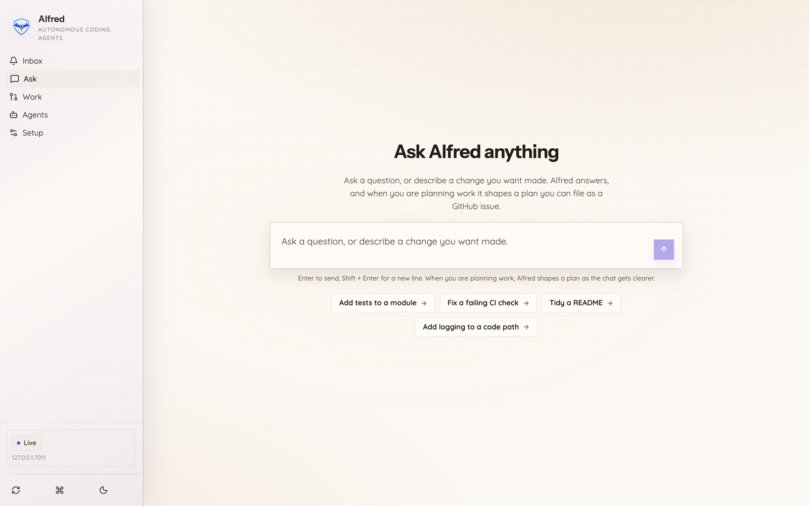

# Talking to Alfred

Status: product contract for Alfred's conversational surfaces (Slack and the
desktop Ask).

Alfred is a colleague you can talk to, not a form you fill in. When you mention
Alfred in Slack, send it a direct message, or type in the desktop Ask box, you
are talking to the underlying model with real context: your repositories, the
live state of the agent fleet, and the lessons Alfred has already learned. The
reply streams back as it is written, the way a person would answer.

This is the bar: a natural conversation that reflects what Alfred knows, at the
level of a capable teammate. Only when you clearly ask for work to be built does
Alfred shift into planning, and even then it offers a plan in plain language
first and waits for your go-ahead before anything is filed or run.

The desktop Ask box is one of those surfaces, in light and dark. Ask a question
and Alfred answers; describe a change and it shapes a plan you can file for the
fleet to build.

<table>
  <tr>
    <td width="50%"> <em>Ask, light.</em></td>
    <td width="50%"> <em>Ask, dark.</em></td>
  </tr>
</table>

This page covers talking to Alfred once it is set up. There is also a
conversational *setup* path, where Alfred asks you setup questions and proposes
each step under an approval gate. That is a separate flow with its own action
allowlist; see [Setting Alfred up](ONBOARDING.md).

When Alfred names an agent in a reply, it uses the display name from your active
theme (the default `batman` theme shows "Lucius" for the `senior-dev` role, and
so on). See [Identity and themes](IDENTITY_AND_THEMES.md).

## What a message does

Every mention, DM, or Ask message is answered conversationally by default. The
same intent path decides the shape of the reply:

- **A question or a chat turn** ("what are you?", "how does review work?",
  "what's the fleet doing?", "why did that run fail?", "what did you ship
  today?") gets a direct, streamed answer grounded in real state. Nothing is
  filed and no draft is opened.
- **A clear build request** ("add a dark mode toggle to settings", "fix the
  login bug in the API") gets a natural reply that reflects the request back and
  offers to turn it into a tracked plan: "I can turn this into a tracked issue
  when you are ready." A plan is drafted only after you confirm.

Alfred never dumps a planning form onto an ambiguous first message. If it is not
sure whether you are asking for work, it talks first.

## Grounding: what Alfred knows in a conversation

A conversation turn is assembled with the same machinery the desktop Ask uses,
so both surfaces answer with the same context:

1. **Repository grounding.** Each repository in scope contributes its
   `CLAUDE.md` (or a file-tree summary when there is none), so Alfred names the
   real surfaces and constraints instead of guessing.
2. **Live fleet status.** A read-only snapshot of what the fleet is doing right
   now: each agent's state (live, idle, error, paused), how many times it ran
   today, and the most recent runs with any classified failure cause. This is
   read from the same runtime the Fleet view shows, so "why did a run fail?" and
   "what shipped today?" are answered from real data, not invention. If the
   snapshot does not contain what you asked about, Alfred says so rather than
   making something up.
3. **Lessons from past work.** When a turn looks like real work, Alfred recalls
   relevant lessons the fleet has already learned and uses them to ask sharper
   questions.

The live snapshot is on by default. Set
`ALFRED_CONVERSE_OPERATIONAL_GROUNDING=0` to omit it (for example to shrink the
prompt, or when the runtime state is known to be stale).

## Streaming

In Slack, Alfred posts a short "thinking" placeholder the instant your message
lands, then progressively rewrites that message as the answer is written
(`chat.update`). Updates are throttled so a fast stream stays comfortably inside
Slack's rate limits, and the final reconciled answer always lands in full. The
desktop Ask streams token by token over Server-Sent Events via the same
`run_turn` path.

## Safety: nothing runs without your approval

The conversation layer is a suggester, never an executor.

- A build turn only ever OFFERS to file a plan in prose. The tracked issue is
  created solely by the existing operator-approval bridge, after you confirm
  (for example by replying `ship it`).
- Any fleet-mutating request phrased in plain language ("queue this", "pause
  Lucius") still surfaces a confirmation card and waits for an operator reaction.
  Natural language can never auto-execute a mutating action.
- Every message is treated as untrusted input: it is wrapped in a hashed
  sentinel boundary so a message cannot forge the boundary or override Alfred's
  rules.
- All of this runs behind the existing trust gate, channel allowlist, and
  seen-event de-duplication.

## Configuration

The conversation layer reads these environment variables. All are optional with
safe defaults; conversation is Alfred's default surface, so the defaults enable
it wherever an engine is configured.

| Variable | Default | Effect |
|---|---|---|
| `ALFRED_SLACK_CONVERSE_ENABLED` | on | Set to `0` to disable Slack conversation and fall back to planning intake. |
| `ALFRED_SLACK_CONVERSE_ENGINE` | falls back to `ALFRED_COMPOSE_CONVERSE_ENGINE` | The model engine used for Slack conversation. Conversation only engages when an engine resolves. |
| `ALFRED_SLACK_CONVERSE_CHANNELS` | all trusted channels | Optional allowlist of channel ids. |
| `ALFRED_COMPOSE_CONVERSE_ENGINE` | unset | The engine used by the desktop Ask (and the Slack fallback engine). |
| `ALFRED_CONVERSE_OPERATIONAL_GROUNDING` | on | Set to `0` to omit the live fleet snapshot from conversation grounding. |
| `ALFRED_INTENT_ROUTER_ENABLED` | on | The plain-language intent router (queue/hold/status/agent control). Set to `0` to disable. |

## Offline fallback

If no engine is configured, or the engine cannot be reached, the surfaces
degrade honestly:

- Slack falls back to the planning-intake draft path (the pre-conversation
  behavior), so a mention is never dropped.
- The desktop Ask returns a `live_session_unavailable` signal and the client
  falls back to the one-shot plan form (the #378 no-engine backstop).

## How this maps to a real agent

The interaction model mirrors what a capable conversational agent does: a single
message becomes one streamed turn, the system prompt is assembled from stable
identity plus live context (repositories, fleet state, lessons) plus the
untrusted transcript, and the model decides whether the turn is a conversation
or the start of real work. The plan surface is a consequence of intent, not a
gate every message is forced through. The difference from a bare chatbot is the
grounding and the safety rails: Alfred answers from real fleet state and never
executes or files anything without an explicit human go-ahead.
