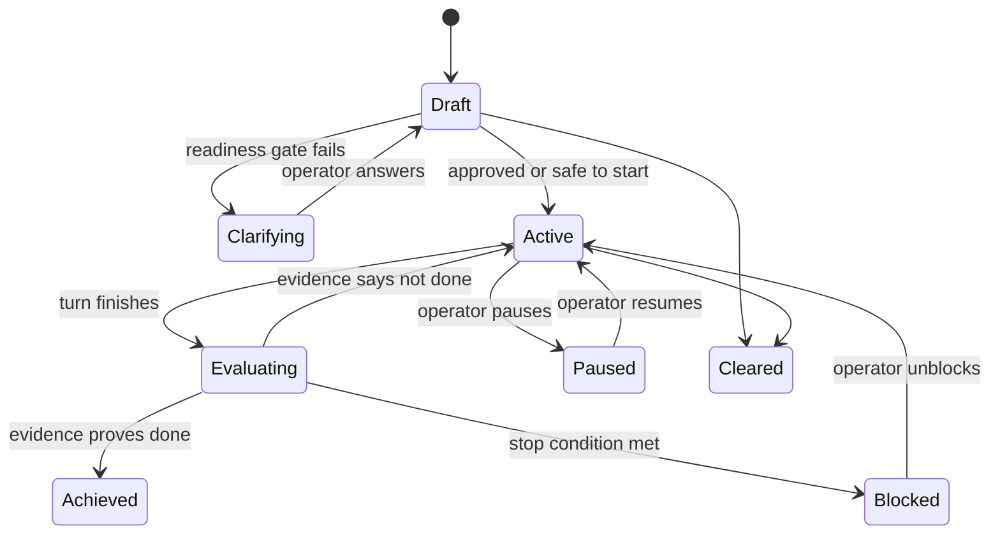

# Alfred goals

Alfred should treat substantial work as a durable goal, not as a loose prompt.
The goal is the operator-owned contract that says what must become true, how
Alfred should prove it, which boundaries stay intact, and when Alfred must stop
for human input.

## Product shape

Slack remains the primary interface. A person should be able to start or refine
a goal in natural language inside a thread:

- "Make onboarding work end to end for my repo."
- "Do not implement yet. Ask me questions until the spec is clear."
- "Keep going until the tests pass, but do not touch billing."
- "Pause this goal."

The native client is the local control surface for the same goal state. It should
show active goals, blocked goals, evidence, plans, runs, memory used, and safe
local actions without pushing the operator into a browser for local Alfred state.

The CLI is the portable substrate, and the durable goal ledger now backs it.
`lib/goals.py` is the on-disk ledger and `alfred goal` is the operator command
that reads and writes it, so Slack, the native client, and the CLI can share one
source of truth. Slack-native and evaluator wiring on top of the ledger is still
tracked under "Alfred Desktop v2" in [`../ROADMAP.md`](../ROADMAP.md).

```sh
alfred goal create "Make onboarding work end to end" \
    --verification "signup flow green in staging" \
    --constraint "do not touch billing" \
    --human-gate "before merging" \
    --repo your-backend
alfred goal list [--status draft|active|blocked|paused|achieved|cleared]
alfred goal status <goal_id> [--events]
alfred goal approve <goal_id>       # draft -> active (alias: activate)
alfred goal pause <goal_id>
alfred goal resume <goal_id>        # paused/blocked -> active
alfred goal clear <goal_id>         # abandon
```

Every goal lives under `$ALFRED_HOME/state/goals/<goal_id>/` as a `goal.json`
entity plus an append-only `events.jsonl` audit trail. The ledger is stdlib-only
so it runs from launchd, the CLI, the server, and tests without an install step,
and every status change goes through a validated lifecycle state machine
(illegal transitions are rejected).

### Wiring goals into a firing (opt-in)

`lib/goal_context.py` is the read-mostly bridge that lets a runner honor active
goals. It is off by default and armed with `ALFRED_GOAL_WIRING=1`. When armed, it
selects the active goals scoped to the repo a firing is about to work, renders a
concise standing-objective block, and offers it to both engines: Claude through
the native `--append-system-prompt` flag and Codex through prompt assembly. It
also appends `attempted` / `evidence_added` events to matching goals when a firing
opens a PR. Every path is fail-soft: a broken or empty ledger degrades to "no
active goal" and never regresses a firing that works today.

Engine-specific goal modes are useful execution hints, but Alfred should not make
them the source of truth. The Alfred goal ledger needs to be shared by Slack, the
native client, the CLI, the planner, the evaluator, and memory. When an engine
supports a native goal contract, Alfred can pass a tightened version into that
engine; Alfred still owns the Slack thread, operator gates, evidence ledger, and
blocked/completed lifecycle.

## Goal contract

A goal should contain:

- **Outcome:** what must be true when Alfred is done.
- **Verification:** tests, screenshots, check output, files, PR state, or other
  evidence that proves completion.
- **Constraints:** repos, files, tools, budgets, safety limits, and non-goals.
- **Iteration policy:** how Alfred chooses the next step after each failed check.
- **Human gates:** when Alfred must ask before implementing, merging, spending,
  deleting, or widening scope.
- **Blocked condition:** what evidence proves Alfred cannot continue responsibly.

## Lifecycle



## Runtime responsibilities

- **Slack listener:** maps thread replies, mentions, and reactions into goal
  events. It should preserve natural conversation, not force command syntax.
- **Planner (Drake):** turns vague work into a spec, asks blocking questions, and
  refuses implementation while readiness is low.
- **Executor (Lucius):** runs the chosen engine and records attempts, evidence,
  and state.
- **Evaluator (Ra's al Ghul):** checks the goal contract against surfaced evidence
  after each attempt. The worker should not be the only judge of completion.
- **Memory layer:** recalls relevant lessons at goal start and proposes new
  memories when a goal exposes repeatable lessons.
- **Client and CLI:** expose the same state and safe actions. The client can be
  absent; Slack plus CLI must still work.

## Design implications

- The native client should favor in-app inspectors, queues, and action panes over
  links to local `alfred serve` pages.
- The Inbox view should summarize decisions, not list every raw event.
- Plans, runs, and memory candidates should be inspectable in-place.
- External links should be explicit: GitHub, Slack, docs, or browser-only
  resources.
- A future Goals tab should be a goal inbox and evidence inspector, not another
  dashboard dump.
