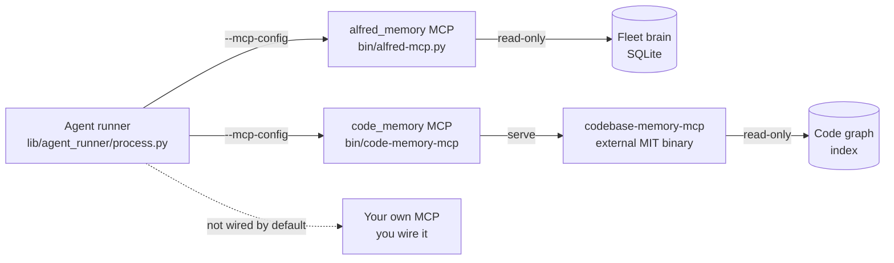

# MCP servers

Alfred attaches Model Context Protocol (MCP) servers to every `claude` firing so
the fleet agents get *tools the model can call on demand* instead of guessing.
Two servers ship with Alfred:

- **`alfred_memory`** gives an agent read-only recall over the local fleet brain:
  what a past firing learned, which files the fleet touched recently, what failed
  and how often, and who owns a path. Instead of re-deriving context from scratch,
  the model asks.
- **`code_memory`** gives an agent read-only code-graph reasoning over the
  in-scope repositories: find a symbol, walk its callers, estimate the blast
  radius of a change, resolve ownership. Instead of grepping blind, the model
  queries a graph.

Both are **capabilities, on by default, read-only by construction**. Neither can
edit a repo, write a lesson, or merge a PR. If either is unavailable, the firing
degrades to a clean no-op and the rest of the run is unaffected.

## Topology

The runner resolves both servers once per invoke and passes them to the `claude`
CLI in a single `--mcp-config` flag (a single `mcpServers` map). The same
resolution feeds the per-agent tool allowlist, so the attached servers and the
allowed tool names can never disagree.

## Servers Alfred provides: `alfred_memory`

`bin/alfred-mcp.py` is a stdlib-only stdio MCP server over the local fleet brain
(`$ALFRED_HOME/fleet-brain.db`). It speaks the JSON-RPC methods MCP clients use
(`initialize`, `tools/list`, `tools/call`) and exposes **only** the tools below.
Every tool is read-only: there is no arbitrary-query escape hatch and no write
path, so no per-tool restriction is needed even under `bypassPermissions`.

| Tool | What it returns | Required scope | Read-only |
|---|---|---|---|
| `alfred_memory_recall` | Trusted (promoted) lessons for a codename or repo, optionally filtered by a query string | `codename` or `repo` | yes |
| `alfred_memory_candidates` | Reviewable memory candidates (status: candidate / validated / rejected / retired / all); returns previews unless raw memory is unlocked | `codename` or `repo` | yes |
| `alfred_recent_file_touches` | Files recently touched by fleet firings, optionally filtered by path | `codename` or `repo` | yes |
| `alfred_failure_patterns` | Normalized non-success events, counted by subtype | `codename` or `repo` | yes |
| `alfred_brain_status` | Fleet-brain row counts and health | none | yes |
| `alfred_memory_doctor` | Read-only health checks over fleet-brain memory | none | yes |
| `alfred_who_owns` | CODEOWNERS owner(s) for a repo path | `repo` and `path` (both required) | yes |
| `alfred_recent_changes_near` | Recent fleet file touches in the same directory as a path | `repo` and `path` (both required) | yes |
| `alfred_prs_touching` | Pull requests that changed a path, from the materialized graph edges | `repo` and `path` (both required) | yes |
| `alfred_code_graph_summary` | Local code-graph summary per repo, no raw source | none | yes |
| `alfred_code_impact` | Local import, symbol, route, API-call, and drift hints for a path | `repo` and `path` (both required) | yes |

### Safety model

- **Summaries, not raw transcripts.** The server exposes allowlisted summaries.
  It never returns raw transcripts, prompts, stdout, stderr, or secrets.
- **Scope is required for row-returning memory queries.** `_require_scope`
  refuses `alfred_memory_recall`, `alfred_memory_candidates`,
  `alfred_recent_file_touches`, and `alfred_failure_patterns` unless the caller
  narrows by `codename` or `repo`. The three path-graph tools
  (`alfred_who_owns`, `alfred_recent_changes_near`, `alfred_prs_touching`) and
  `alfred_code_impact` require *both* a `repo` and a `path` via
  `_require_repo_path`. This keeps an agent from sweeping the whole brain.
- **Candidate bodies are gated.** `alfred_memory_candidates` returns a short
  `body_preview` and boolean flags by default. Full candidate bodies, evidence,
  and review notes are only included when `ALFRED_MCP_ALLOW_RAW_MEMORY` is set
  to `1`, `true`, or `yes` (`_raw_memory_allowed`). Leave it unset for the
  default preview-only posture.

Note: the same tool set is also reachable through `alfred mcp serve`; see
[FLEET_BRAIN.md](FLEET_BRAIN.md).

## Servers Alfred consumes: `code_memory`

`code_memory` is the code-structure layer. Alfred does not implement it; it
launches [codebase-memory-mcp](https://github.com/DeusData/codebase-memory-mcp)
(DeusData, MIT), a standalone external binary, through the `bin/code-memory-mcp`
launcher. The binary is **never vendored** into this repository, so the tree
stays OSS-clean and passes `scrub-check`.

The launcher pins an upstream release (`ALFRED_CODE_MEMORY_VERSION`, default
`v0.8.1`, from `DeusData/codebase-memory-mcp`) and, on first use, fetches the
per-platform tarball from GitHub releases. The download is **sha256-verified
against a pinned digest before it is extracted or made executable**; a mismatch
deletes the download and fails closed, so an unverified binary is never run.
Auto-fetch is opt-out (`ALFRED_CODE_MEMORY_AUTOFETCH=0`), in which case a missing
binary is a clean no-op.

Binary resolution order (first hit wins): `ALFRED_CODE_MEMORY_BIN`, then
`codebase-memory-mcp` on `PATH`, then the pinned cache at
`$ALFRED_HOME/bin/codebase-memory-mcp`.

The tools Alfred allows from this server (kept as a fixed allowlist so a future
upstream tool cannot silently widen agent capability without a code change in
`process.py`):

| Tool | What it does | Read-only |
|---|---|---|
| `search_code` | Search the code graph for symbols, definitions, and references | yes |
| `call_graph` | Callers and callees for a function | yes |
| `impact_analysis` | Blast radius of a proposed change | yes |
| `who_owns` | Ownership of a file or symbol | yes |

For indexing, scope configuration, and the local `alfred-codegraph@1` fallback,
see [CODE_MEMORY.md](CODE_MEMORY.md).

## Per-role tool scoping

The allowlist is assembled in `lib/agent_runner/process.py`, and it is read-only
by design:

1. The runner resolves the memory-server path **once** per invoke
   (`_memory_mcp_script()`) and shares it with both the allowlist builder and the
   `--mcp-config` attachment, so the two can never disagree (no TOCTOU between two
   separate existence checks).
2. `_with_memory_mcp_tools` appends the memory tool names
   (`mcp__alfred_memory__*`) to the agent's existing allowlist, but only when the
   memory MCP is enabled and its server script exists. It preserves the caller's
   separator style and skips names already present.
3. When the code-memory server resolves, `_code_memory_tool_names` appends the
   `mcp__code_memory__*` names from the fixed `_CODE_MEMORY_TOOLS` allowlist.
4. `_memory_mcp_args` builds the single `--mcp-config` flag containing whichever
   of the two servers are enabled and resolvable.

Because both servers expose only read-only tools, **no write, merge, or
mutate tool ever reaches any agent through MCP**. The allowlist is additive:
it can only grant the specific read tools named in the two constants
(`_MEMORY_RECALL_TOOLS`, `_CODE_MEMORY_TOOLS`), never widen beyond them.

## Configuration and disabling

All knobs are environment variables. Set them in `$ALFRED_HOME/.env`. Defaults
work out of the box; both servers are on by default.

| Variable | Default | What it does |
|---|---|---|
| `ALFRED_MEMORY_MCP` | `1` (on) | Attach the `alfred_memory` MCP to firings. Any of `0`, `false`, `no`, `off`, or empty disables it. |
| `ALFRED_CODE_MEMORY_MCP` | `1` (on) | Attach the `code_memory` MCP to firings. Same disable values. |
| `ALFRED_MCP_ALLOW_RAW_MEMORY` | (unset) | When `1` / `true` / `yes`, `alfred_memory_candidates` includes full bodies, evidence, and review notes instead of previews. Leave unset for preview-only. |
| `ALFRED_FLEET_BRAIN_DB` | `$ALFRED_HOME/fleet-brain.db` (else `~/.alfred/fleet-brain.db`) | Explicit path to the SQLite brain the `alfred_memory` server reads. |
| `ALFRED_HOME` | `~/.alfred` | Runtime home. Resolves the default brain path and the code-memory cache. |
| `ALFRED_CODE_MEMORY_BIN` | (unset) | Explicit path to the `codebase-memory-mcp` binary. Skips PATH and auto-fetch. |
| `ALFRED_CODE_MEMORY_VERSION` | `v0.8.1` | Pinned upstream release tag to fetch. |
| `ALFRED_CODE_MEMORY_AUTOFETCH` | `1` (on) | Fetch the pinned binary on first use. Set `0` for a strict no-network install. |

The full code-memory knob set (scope lists, index directories, timeouts) lives
in [CODE_MEMORY.md](CODE_MEMORY.md).

To turn MCP off entirely for a run, set both `ALFRED_MEMORY_MCP=0` and
`ALFRED_CODE_MEMORY_MCP=0`. Agents still run; they just fall back to reading and
grepping the working tree directly.

## Adding your own MCP server

Today the runner wires exactly the two servers above. It does not read an
arbitrary user MCP registry, so a server you add would need explicit wiring in
`lib/agent_runner/process.py`: add it to the `mcpServers` map that
`_memory_mcp_args` builds, and add its tool names to the allowlist the way
`_code_memory_tool_names` does. Nothing consumes a user-supplied MCP config
automatically yet, so this is a code change, not a config toggle.

Before you attach anything, keep the same posture the built-in servers hold:
read-only tools, a fixed tool allowlist (so an upstream update cannot silently
widen agent capability), and no path that can mutate a repo or leak raw
transcripts and secrets. Review [THREAT_MODEL.md](THREAT_MODEL.md) for the
containment boundaries a firing is expected to respect, and confirm your server
does not weaken them.
