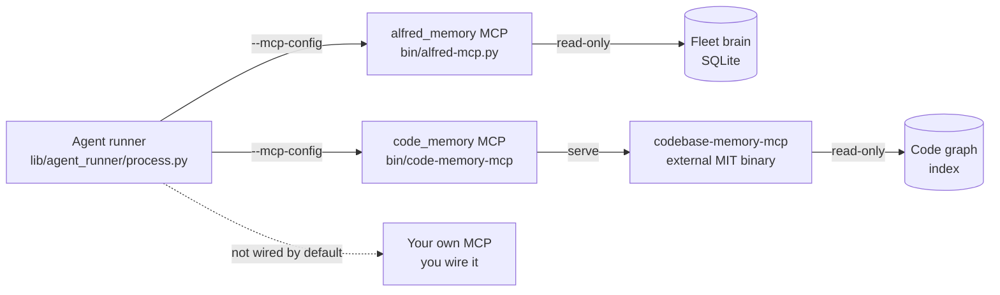

# MCP servers

Alfred attaches Model Context Protocol (MCP) servers to **Claude-engine
firings** so the fleet agents get *tools the model can call on demand* instead
of guessing. MCP is a Claude Code feature: the servers and their tools are
wired in `claude_invoke` and `claude_invoke_streaming` only. **Codex-routed
firings do not get MCP servers or tools** (`codex_invoke` builds a `codex exec`
command with no `--mcp-config`, and Codex does not expose Claude's tool
allowlist). An agent routed to Codex reads and greps the working tree directly.
See [ENGINE_ROUTING.md](ENGINE_ROUTING.md) for how a codename is routed to
Claude versus Codex.

Two servers ship with Alfred:

- **`alfred_memory`** gives an agent read-only recall over the local fleet brain:
  what a past firing learned, which files the fleet touched recently, what failed
  and how often, and who owns a path. Instead of re-deriving context from scratch,
  the model asks.
- **`code_memory`** gives an agent read-only code-graph reasoning over the
  in-scope repositories: find a symbol, walk its callers, estimate the blast
  radius of a change, resolve ownership. Instead of grepping blind, the model
  queries a graph.

Both are **capabilities, on by default, read-only by construction**. Neither can
edit a repo, write a lesson, or merge a PR. If either is unavailable, the firing
degrades to a clean no-op and the rest of the run is unaffected.

## Topology

On a Claude firing the runner resolves both servers once per invoke and passes
them to the `claude` CLI in a single `--mcp-config` flag (a single `mcpServers`
map). It resolves the `alfred_memory` server *script path* exactly once and
shares that one resolved path between the `--mcp-config` attachment and the tool
allowlist, so the two can never disagree about **whether** the server is present
(no TOCTOU between two separate `Path.exists()` checks).

This shared-path guarantee is about attachment, not about which tools an agent
can call. Attach and allowlist are **two distinct gates**:

1. **Attaching** a server (`--mcp-config`) *exposes* its tools to the run: the
   `claude` process can see everything the server lists over `tools/list`.
2. **The allowlist** (`--allowedTools`, a hardcoded list of
   `mcp__<server>__<tool>` names built from two fixed constants in `process.py`)
   decides which of those exposed tools the agent may actually *call*.

Both gates must pass. Exposure alone does not make a tool callable, so a tool a
server newly returns is **not** automatically usable by the agent: it stays
uncallable until its `mcp__<server>__<tool>` name is added to the allowlist
constant. The two sets are therefore not identical: the `alfred_memory` server
registers twelve tools, but the allowlist constant names eleven of them (see the
note under the tool table). See [Per-role tool scoping](#per-role-tool-scoping)
for exactly how the allowlist is assembled.

## Servers Alfred provides: `alfred_memory`

`bin/alfred-mcp.py` is a stdlib-only stdio MCP server over the local fleet brain
(`$ALFRED_HOME/fleet-brain.db`). It speaks the JSON-RPC methods MCP clients use
(`initialize`, `tools/list`, `tools/call`) and exposes **only** the tools below.
Every tool is read-only: there is no arbitrary-query escape hatch and no write
path, so no per-tool restriction is needed even under `bypassPermissions`.

| Tool | What it returns | Required scope | Read-only |
|---|---|---|---|
| `alfred_memory_recall` | Trusted (promoted) lessons for a codename or repo, optionally filtered by a query string | `codename` or `repo` | yes |
| `alfred_memory_candidates` | Reviewable memory candidates (status: candidate / validated / rejected / retired / all); returns previews unless raw memory is unlocked | `codename` or `repo` | yes |
| `alfred_recent_file_touches` | Files recently touched by fleet firings, optionally filtered by path | `codename` or `repo` | yes |
| `alfred_failure_patterns` | Normalized non-success events, counted by subtype | `codename` or `repo` | yes |
| `alfred_brain_status` | Fleet-brain row counts and health | none | yes |
| `alfred_memory_doctor` | Read-only health checks over fleet-brain memory | none | yes |
| `alfred_who_owns` | CODEOWNERS owner(s) for a repo path | `repo` and `path` (both required) | yes |
| `alfred_recent_changes_near` | Recent fleet file touches in the same directory as a path | `repo` and `path` (both required) | yes |
| `alfred_prs_touching` | Pull requests that changed a path, from the materialized graph edges | `repo` and `path` (both required) | yes |
| `alfred_code_graph_summary` | Local code-graph summary per repo, no raw source | none | yes |
| `alfred_code_impact` | Local import, symbol, route, API-call, and drift hints for a path | `repo` and `path` (both required) | yes |
| `alfred_code_blast_radius` | Local multi-file blast-radius summary for changed paths | `repo` and `paths` (both required) | yes |
| `alfred_code_skeleton` | Structure-only file skeleton (signatures, docstring, elided bodies) from the code map | `repo` and `path` (both required) | yes |
| `alfred_read_delta` | Delta-aware file read: full on first read, unified diff on re-read this firing | `repo` and `path` (both required) | yes |

All twelve tools above are registered on the server (the `TOOLS` tuple in
`bin/alfred-mcp.py`), so attaching the server exposes all twelve to the run.
Being exposed is not the same as being callable by the agent: a firing can only
call the tools whose names are in the `--allowedTools` allowlist. **One
registered tool, `alfred_memory_doctor`, is not in that allowlist**: the
`_MEMORY_RECALL_TOOLS` constant in `process.py` names the other eleven, so the
agent cannot call `alfred_memory_doctor` even though the server exposes it.
`alfred_brain_status` covers the same read-only doctor output and is in the
allowlist, so an agent does not lose that capability. The exposed-but-not-
allowlisted tool remains available to any MCP client that talks to the server
directly, for example through `alfred mcp serve`.

### Safety model

- **Summaries, not raw transcripts.** The server exposes allowlisted summaries.
  It never returns raw transcripts, prompts, stdout, stderr, or secrets.
- **Scope is required for row-returning memory queries.** `_require_scope`
  refuses `alfred_memory_recall`, `alfred_memory_candidates`,
  `alfred_recent_file_touches`, and `alfred_failure_patterns` unless the caller
  narrows by `codename` or `repo`. The three path-graph tools
  (`alfred_who_owns`, `alfred_recent_changes_near`, `alfred_prs_touching`) and
  `alfred_code_impact`, `alfred_code_skeleton`, and `alfred_read_delta` require
  *both* a `repo` and a `path` via `_require_repo_path`;
  `alfred_code_blast_radius` requires `repo` plus at least one path. This keeps
  an agent from sweeping the whole brain. See
  [SKELETON_READS.md](SKELETON_READS.md) for the skeleton and delta tools.
- **Candidate bodies are gated.** `alfred_memory_candidates` returns a short
  `body_preview` and boolean flags by default. Full candidate bodies, evidence,
  and review notes are only included when `ALFRED_MCP_ALLOW_RAW_MEMORY` is set
  to `1`, `true`, or `yes` (`_raw_memory_allowed`). Leave it unset for the
  default preview-only posture.

Note: the same tool set is also reachable through `alfred mcp serve`; see
[FLEET_BRAIN.md](FLEET_BRAIN.md).

## Servers Alfred consumes: `code_memory`

`code_memory` is the code-structure layer. Alfred does not implement it; it
launches [codebase-memory-mcp](https://github.com/DeusData/codebase-memory-mcp)
(DeusData, MIT), a standalone external binary, through the `bin/code-memory-mcp`
launcher. The binary is **never vendored** into this repository, so the tree
stays OSS-clean and passes `scrub-check`.

The launcher pins an upstream release (`ALFRED_CODE_MEMORY_VERSION`, default
`v0.8.1`, from `DeusData/codebase-memory-mcp`) and, on first use, fetches the
per-platform tarball from GitHub releases. The download is **sha256-verified
against a pinned digest before it is extracted or made executable**; a mismatch
deletes the download and fails closed, so an unverified binary is never run.
Auto-fetch is opt-out (`ALFRED_CODE_MEMORY_AUTOFETCH=0`), in which case a missing
binary is a clean no-op.

Binary resolution order (first hit wins): `ALFRED_CODE_MEMORY_BIN`, then
`codebase-memory-mcp` on `PATH`, then the pinned cache at
`$ALFRED_HOME/bin/codebase-memory-mcp`.

The tools Alfred allows from this server (kept as a fixed allowlist so a future
upstream tool cannot silently widen agent capability without a code change in
`process.py`):

| Tool | What it does | Read-only |
|---|---|---|
| `search_code` | Search the code graph for symbols, definitions, and references | yes |
| `call_graph` | Callers and callees for a function | yes |
| `impact_analysis` | Blast radius of a proposed change | yes |
| `who_owns` | Ownership of a file or symbol | yes |

For indexing, scope configuration, and the local `alfred-codegraph@1` fallback,
see [CODE_MEMORY.md](CODE_MEMORY.md).

## Per-role tool scoping

Scoping happens in `lib/agent_runner/process.py`, only on the Claude path
(`claude_invoke` and `claude_invoke_streaming`). It runs two distinct gates:
**attaching** the servers (exposure) and **allowlisting** their tool names
(callability). A tool must clear both gates before an agent can use it.

1. The runner resolves the `alfred_memory` server *script path* **once** per
   invoke (`_memory_mcp_script()`) and passes that one resolved value to both the
   allowlist builder and the `--mcp-config` attachment. This shared path is what
   guarantees the two agree about **whether** the memory server is present (no
   TOCTOU between two separate existence checks). It is a presence guarantee, not
   a promise that the attached tool set and the allowlisted tool set are equal.
2. `_memory_mcp_args` builds the single `--mcp-config` flag containing whichever
   of the two servers are enabled and resolvable. Attaching a server **exposes**
   every tool it lists over `tools/list` to the run, but exposure alone does not
   make a tool callable.
3. `_with_memory_mcp_tools` builds the `--allowedTools` list, which is what
   decides callability. It appends tool *names* from two fixed constants: the
   memory names (`mcp__alfred_memory__*`) from `_MEMORY_RECALL_TOOLS`, added only
   when the memory MCP is enabled and its script exists; and the
   `mcp__code_memory__*` names from `_CODE_MEMORY_TOOLS`, added only when the
   code-memory server resolves. It preserves the caller's separator style and
   skips names already present. A tool a server exposes but this list omits is
   **not** callable by the agent.

Because exposure and the allowlist are populated independently, the exposed and
callable sets are not guaranteed identical. In practice the code-memory sets
match, while `alfred_memory` exposes twelve server tools and `_MEMORY_RECALL_TOOLS`
allowlists eleven (`alfred_memory_doctor` is the one it omits, so the agent cannot
call it; `alfred_brain_status` gives an agent the same doctor output). The
allowlist is the tighter, load-bearing gate.

Both servers expose only read-only tools, so **no write, merge, or mutate tool
ever reaches any agent through MCP**, regardless of which set you read. Keeping
the allowlist from two fixed constants also means a future upstream tool cannot
silently widen agent capability without a code change to
`_MEMORY_RECALL_TOOLS` or `_CODE_MEMORY_TOOLS`.

## Configuration and disabling

All knobs are environment variables. Set them in `$ALFRED_HOME/.env`. Defaults
work out of the box; both servers are on by default (on Claude firings, the only
firings that get MCP at all).

| Variable | Default | What it does |
|---|---|---|
| `ALFRED_MEMORY_MCP` | `1` (on) | Attach the `alfred_memory` MCP to Claude firings. Any of `0`, `false`, `no`, `off`, or empty disables it. |
| `ALFRED_CODE_MEMORY_MCP` | `1` (on) | Attach the `code_memory` MCP to Claude firings. Same disable values. |
| `ALFRED_MCP_ALLOW_RAW_MEMORY` | (unset) | When `1` / `true` / `yes`, `alfred_memory_candidates` includes full bodies, evidence, and review notes instead of previews. Leave unset for preview-only. |
| `ALFRED_FLEET_BRAIN_DB` | `$ALFRED_HOME/fleet-brain.db` (else `~/.alfred/fleet-brain.db`) | Explicit path to the SQLite brain the `alfred_memory` server reads. |
| `ALFRED_HOME` | `~/.alfred` | Runtime home. Resolves the default brain path and the code-memory cache. |
| `ALFRED_CODE_MEMORY_BIN` | (unset) | Explicit path to the `codebase-memory-mcp` binary. Skips PATH and auto-fetch. |
| `ALFRED_CODE_MEMORY_VERSION` | `v0.8.1` | Pinned upstream release tag to fetch. |
| `ALFRED_CODE_MEMORY_AUTOFETCH` | `1` (on) | Fetch the pinned binary on first use. Set `0` for a strict no-network install. |

The full code-memory knob set (scope lists, index directories, timeouts) lives
in [CODE_MEMORY.md](CODE_MEMORY.md).

To turn MCP off entirely for a Claude run, set both `ALFRED_MEMORY_MCP=0` and
`ALFRED_CODE_MEMORY_MCP=0`. Agents still run; they just fall back to reading and
grepping the working tree directly, the same way a Codex-routed agent already
does.

## Adding your own MCP server

Today the runner wires exactly the two servers above, and only on the Claude
path. It does not read an arbitrary user MCP registry, so a server you add would
need explicit wiring in `lib/agent_runner/process.py`: add it to the
`mcpServers` map that `_memory_mcp_args` builds, and add its tool names to the
allowlist the way `_code_memory_tool_names` does. Both of those run inside
`claude_invoke` / `claude_invoke_streaming`, so a server wired there reaches
Claude firings only; `codex_invoke` has no MCP attachment point. Nothing consumes
a user-supplied MCP config automatically yet, so this is a code change, not a
config toggle.

Before you attach anything, keep the same posture the built-in servers hold:
read-only tools, a fixed tool allowlist (so an upstream update cannot silently
widen agent capability), and no path that can mutate a repo or leak raw
transcripts and secrets. Review [THREAT_MODEL.md](THREAT_MODEL.md) for the
containment boundaries a firing is expected to respect, and confirm your server
does not weaken them.
