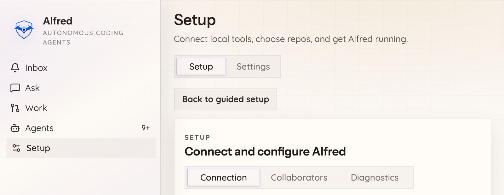
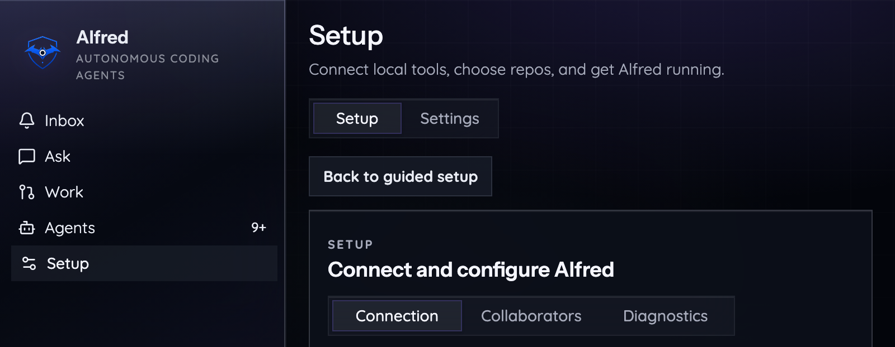

# Screenshots

Alfred's desktop app (and the same UI served in a browser via `alfred serve`)
runs entirely on your machine. It is theme-aware, so every screen is shown here
in both light and dark.

## Ask: from a question to a plan to a pull request

The Ask surface is where a plain-English request becomes real work. Ask a
question and Alfred answers; describe a change and it shapes a plan you can file
as a GitHub issue for the fleet to build, review, and ship. No API keys: Alfred
runs on the Claude and Codex subscriptions you already pay for.

| Light | Dark |
|---|---|
|  |  |

## Setup: guided install to a working fleet

Guided, conversational onboarding checks your machine, connects to GitHub,
picks your team, and ends on a real result you can see. Scheduled agents can run
in the background; gated plans and shipping stop for your approval.

| Light | Dark |
|---|---|
|  |  |

## The loop these screens drive

Behind the UI, a request runs the full engineering loop on your own machine:

```
plan  ->  approve  ->  build  ->  review (adversarial)  ->  fix  ->  ship
```

You can watch the whole loop end to end on a throwaway repo, with no GitHub,
Slack, or tokens, by running:

```sh
alfred demo
```

It plans a feature, waits for your approval, builds it, reviews it (the reviewer
is prompted to find real problems), applies the fix the reviewer demanded, runs
the tests, and ends on a PR-style summary.
