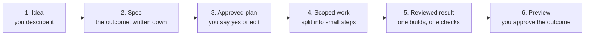

# Spec-driven work, in plain words

## The big idea

You describe an outcome, in your own words. Alfred writes it down as a short
plan, checks with you, does the work, and shows you a preview to approve. You
never write the plan, read the code, or open anything technical. You say what
you want, answer a question or two, and give a thumbs-up when it looks right.
The careful engineering still happens behind the scenes, but you only ever deal
with the outcome.

## How it works



## What you actually do

There are only three things:

1. **Describe it.** Say what you want in plain language, the way you would say it
   out loud: "make the signup button on the welcome screen green."
2. **Answer a question or two.** Alfred may ask something short and plain, like
   "Which screen is this on?" Answer in ordinary words.
3. **Approve a preview.** When the work is ready, you look at the result and say
   whether it is what you wanted.

## What you never have to do

- Write a spec.
- Read code.
- Name a repository or any technical location.
- Open a pull request or touch anything on GitHub.

Alfred does all of that quietly for you.

## Two words worth knowing

- **Spec.** The outcome, written down: what should be different, and how anyone
  can tell it worked. Alfred writes it; you only approve it.
- **Preview.** A look at the finished result before it goes live, so you can
  approve the outcome rather than the code that produced it.

## When Alfred asks a question

If something important is unclear, Alfred stops and asks instead of guessing.
An unanswered question holds the work in place on purpose: a wrong guess is
worse than a short pause, so Alfred will not proceed until you have answered.
Answering in plain words is enough. You do not need to be precise or technical,
just clear about what you meant. Once you answer, the work moves again.

## Turning it on

Plain mode is a single setting on whatever surface talks to you (a chat message
or the desktop app):

```sh
export ALFRED_INTAKE_PROFILE=plain
```

With it on, Alfred asks plain questions and shows a plain plan instead of
technical commands. Leave it unset and the original, more technical experience
stays exactly as it was. For the full walk-through of plain mode, see
[PLAIN_MODE.md](PLAIN_MODE.md).

## For the curious

If you want to see how the same work looks from an engineer's seat, with the
full spec shape and the team that builds and reviews it, read
[SPECS_DRIVEN_DEVELOPMENT.md](SPECS_DRIVEN_DEVELOPMENT.md).
