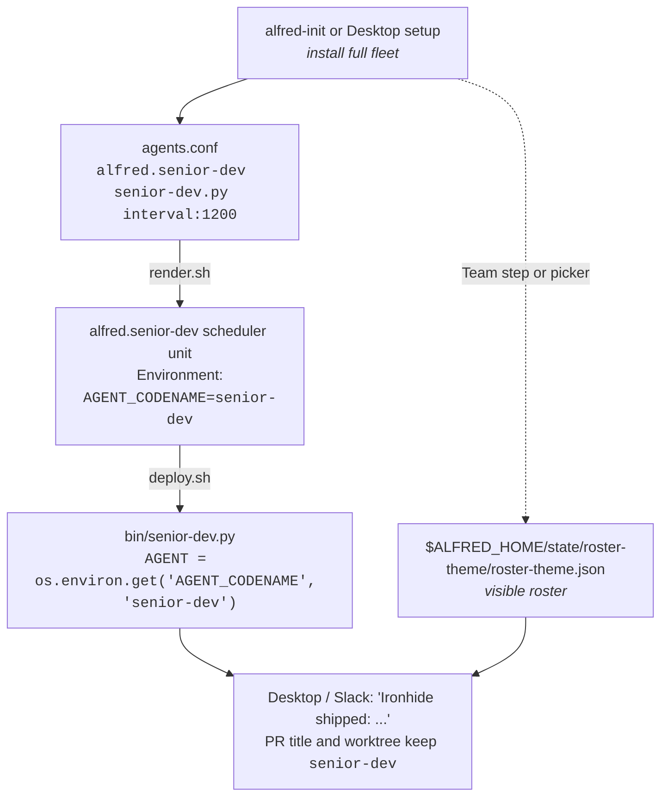

Alfred expects one agent script per narrow specialist. The runtime identity is a stable **role slug** like `senior-dev`, `reviewer`, or `architect`; the human-friendly name comes from the active roster theme. The default `batman` theme shows those roles as Lucius, Ra's al Ghul, Batman, and the rest of the Gotham cast.

The roles coordinate via labels and GitHub state, not in-process calls.

## What "narrow specialist" means

One role, one job:

| Role slug | Default theme name | Single job |
|---|---|---|
| `architect` | Batman | Architect public `agent:large-feature` parent issues. Waits for approval, then drives the approved rollout into scoped child issues. Runner-gated in OSS. |
| `senior-dev` | Lucius | Pick the oldest `agent:implement` issue, claim it, ask the configured engine to implement, push a branch, open a PR. |
| `planner` | Drake | Read specs + roadmap + code-reality grep, file the next well-scoped `agent:implement` issue. |
| `test-engineer` | Bane | Pick the lowest-coverage actively-changed file, write tests, open a PR. |
| `reviewer` | Ra's al Ghul | Multi-axis review on every fresh PR. |
| `fixer` | Nightwing | Apply P0/P1 reviewer comments on `agent:authored` PRs. |
| `triage` | Robin | Triage new bug-report issues; classify severity, ask for repro info. |
| `e2e-runner` | Huntress | Post-deploy E2E smoke against staging. |
| `ops-watch` | Gordon | Daily ECS drift + Sentry top-N read. |
| `agent-cleanup` | Agent cleanup | Sweep stale claims, locks, transcripts, and worktrees. |

What the pattern is not:

- Not "one agent does everything". A single Lucius doing feature dev, tests, review, triage, and smoke would become hard to operate and harder to review.
- Not "the smallest possible unit of work per agent". A separate codename for "create branch", "commit", and "push" is too small to be a useful role.

The right granularity is one human role. If you would hire someone to do this job and review their work, it is a role Alfred can model.

## Why themed names

Two reasons.

### Operational legibility

Visible roster names show up in:

- Slack messages (`Lucius shipped: <url>`)
- Desktop cards
- Onboarding and the roster picker
- Human shorthand in planning conversations

Role slugs show up in:

- PR metadata and labels
- Commit trailers (`Agent-Codename: senior-dev`)
- Slack messages (`✅ Lucius shipped: <url>`)
- Issue labels and claim comments
- Worktree paths (`~/.alfred/worktrees/eng-senior-dev-backend-303-...`)
- Logs (`/tmp/alfred.senior-dev.stdout`)

If your visible roster is "agent-1 / agent-2 / agent-3" or raw slugs only, scanning the firehose becomes laborious. A coherent theme makes "Lucius failed on #303" instantly readable while keeping `senior-dev` stable underneath.

### Design forcing function

"What does Bane do?" is a sharper question than "what does the test agent do?". Giving the role a memorable visible name forces you to decide:

- What's Bane's scope? Brute-force test coverage on changed files. Not unit-test design philosophy.
- What does Bane never do? Never modifies non-test files. Never opens an architecture issue.
- How does Bane interact with the others? Bane's PRs go through Ra's al Ghul like any other PR. Bane consumes from the same `agent:implement` queue Lucius does, but only files labelled `test-coverage`.

Without the role boundary, "the test agent" tends to creep: "well, while it's there, it could also lint... and run a security scan...". With the named role, the answer is "no, that's not Bane. Bane writes tests."

## Pick your own roster theme

The default install ships the Batman roster, and Alfred Desktop can re-skin the
visible roster with preset themes or custom display names without changing the
underlying role slugs, scheduler labels, or GitHub state machine. If you add
operator-defined runtime agents with `alfred agent add`, pick names from the
same coherent theme:

- **Greek pantheon**: Athena (planner), Hephaestus (feature dev), Iris (notifier), Asclepius (deploy health).
- **The Wire**: Bunk (review), McNulty (triage), Omar (security audit), Lester (bug investigation).
- **Tolkien**: Aragorn, Legolas, Gimli, Gandalf. Watch lore consistency (Gandalf shouldn't review Frodo's PR).
- **Your favourite anime, novel, podcast, board game.** All work.

Constraints for visible names:

- Short single-line names. Long names pollute Slack scrolling.
- Pronounceable. You are going to say "Lucius shipped #303" out loud at some point.
- Consistent across the fleet. Don't mix Batman + Star Wars; pick one universe.

## The wiring

Each role has:

- **A bin script**: `bin/<role>.py`. Imports from `agent_runner`. ~150-300 lines.
- **A scheduler entry**: one line in `launchd/agents.conf` (label, script, schedule, Java flag, log stem, role).
- **Or a custom-agent manifest row**: `alfred agent add` writes `$ALFRED_HOME/state/custom-agents/custom-agents.json`, and deploy renders it through `bin/custom-agent.py`.
- **(Optional) A prompt file**: built-in roles seed from repo templates such as `prompts/feature-dev.md`, then read runtime overrides from `$ALFRED_HOME/prompts/<role-slug>.md` in your fleet. For example, the `senior-dev` role seeds from `prompts/feature-dev.md` but loads `$ALFRED_HOME/prompts/senior-dev.md` after install.
- **(Optional) An IAM identity**: if it touches AWS. See [AWS setup](/guides/aws/).
- **A row in your repo guidance file** (`AGENTS.md` or `CLAUDE.md`) documenting role + trigger + scope.

The role implementation lives in `bin/<role-slug>.py` (the filename never changes). The role slug flows in at runtime through the rendered scheduler unit:

The bin script filename stays `senior-dev.py` because it is the role
implementation. Custom display names change what humans see, not the scheduler
contract. When you add an operator-defined runtime agent, Alfred shows it in
status, schedule, setup inventory, and the custom roster editor as soon as the
manifest exists; `bash deploy.sh` turns enabled custom agents into host
scheduler jobs. The generic custom runner is read-only by default; use a
dedicated runner for deterministic PR-writing roles.

[Tutorial](/getting-started/tutorial/) for an end-to-end build of one custom role. The [agent fleet](/concepts/fleet/) page maps the default roster and how the roles hand work to each other.

## Anti-patterns

- **Generic visible names**: "agent-1", "feature-bot", "the planner". The cast disappears as a forcing function; prompts bloat.
- **Names coupled to tools**: "lucius-grpc", "bane-pytest". Couples the visible name to the implementation; you cannot refactor the tool without renaming the role.
- **Cross-cast mixing**: Lucius (Batman) + Athena (Greek) + Bunk (The Wire). Chaotic in Slack.
- **One role per repo** instead of one narrow job: "backend-bot", "frontend-bot". Loses the role-as-narrow-specialist forcing function.
- **Display name as adjective**: "smart-lucius", "fast-lucius". The visible name is the specialist; modifiers do not add anything.
