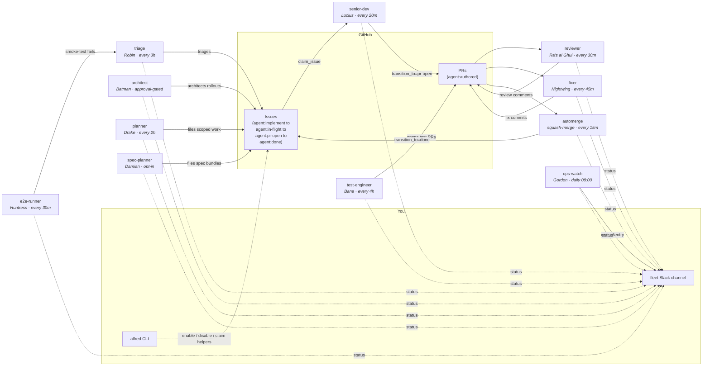

The default Alfred install ships an engineering-focused fleet. Each agent is a narrow specialist with its own schedule, turn budget, and tool list. The **role slug** is the machine identity (`architect`, `senior-dev`, `reviewer`); the visible name comes from the active roster theme. In the default `batman` theme, those roles show as Batman, Lucius, Ra's al Ghul, and the rest of the Gotham cast.

Nothing chats with anything else behind your back: the agents coordinate through GitHub issues and PRs, and report to one Slack channel.

Full role map at [`docs/AGENTS.md`](https://github.com/luminik-io/alfred/blob/main/docs/AGENTS.md).

## How work flows

Solid arrows are state transitions (someone modifies an issue or PR). Dashed arrows are observability (someone reports).



The loop closes on itself: the architect role (Batman in the default theme) leads multi-repo rollouts, the planner role scopes smaller work, the senior developer and test engineer implement it, the reviewer checks it, the fixer clears review feedback, automerge ships, and the merge transitions the issue to `agent:done`. Triage and E2E smoke feed the loop with bug reports. Your first required action is usually labelling issues `agent:implement` and reviewing PRs before merge.

## Batman: the architect role's default name

Batman is the default-theme name for the `architect` role. The role leads a whole feature across repos. Where the `senior-dev` role implements one scoped issue at a time inside one repo, the architect parent-plan path reads one `agent:large-feature` issue, walks the affected repos, drafts the rollout plan, waits for approval, and only then files scoped `agent:implement` child issues across every repo that needs work.

This is what makes Alfred different from single-repo coding agents. A backend service change that needs a frontend page, a mobile screen, and a data-infra job becomes one architect plan with four children, instead of four manual context-rebuilds in a chat window.

The architect role is part of the public fleet and runs on the same local schedule model as the other agents, but execution is deliberately gated. A fresh full install configures it and keeps it behind `alfred enable architect`. `ARCHITECT_PARENT_REPO` selects the repo where the role reads `agent:large-feature` parent issues; the default `ARCHITECT_AUTO_EXECUTE=0` halts after the plan. Set `ARCHITECT_AUTO_EXECUTE=approval-gate` when you want the architect to file child issues only after Slack or Alfred client approval, or `1` only for fleets that intentionally skip the gate.

See [Worked example: Batman across three repos](/guides/multi-repo-worked-example/) for an end-to-end walkthrough from large-feature issue to merged children.

## The default roster

Schedules are sensible defaults; override per-agent in `agents.conf`.

The engineering hierarchy starts with `architect`, `senior-dev`, and `planner`:
Batman, Lucius, and Drake in the default theme. The architect plans cross-repo
features, the senior developer ships repo-local implementation PRs,
and the planner scopes smaller single-repo requests. A fresh install configures the
full roster by default. Use `--agents starter` only when you deliberately want a
small lab roster.

High-impact agents are visible without being accidentally armed. The architect stays
behind the runner gate until `alfred enable architect` and then still obeys
`ARCHITECT_AUTO_EXECUTE`. The E2E and ops-watch roles load with the fleet and self-idle
until their staging target URL or ECS cluster exists.

### Specialist agents

| Role slug | Name in default theme | Default schedule | What it does |
|---|---|---|---|
| `architect` | Batman | every 1 h, approval-gated | Leads multi-repo features. Drafts the rollout, waits for Slack or Alfred client approval, files child `agent:implement` issues, and reports status so implementation can move in parallel. See [docs/ARCHITECT.md](https://github.com/luminik-io/alfred/blob/main/docs/ARCHITECT.md). |
| `senior-dev` | Lucius | every 20 min | Picks the oldest open `agent:implement` issue, claims it via the state machine, opens a worktree, runs the configured engine with the issue body + repo context, pushes a PR labelled `agent:authored`. |
| `planner` | Drake | every 2 h | Reads specs, roadmap, cross-repo open-issue list, and a code-reality grep. Files the next well-scoped `agent:implement` issue. Caps at 5 issues per firing, 20 in a rolling 24 h. |
| `spec-planner` | Damian | daily 09:00, opt-in | Walks `ALFRED_SPEC_PLANNER_SPEC_DIR`, identifies multi-repo features, and files `agent:bundle:<slug>` siblings across the affected repos. All-or-nothing per bundle. Caps at 3 bundles per firing. Single-repo work is left to the planner. |
| `test-engineer` | Bane | every 4 h | Picks the lowest-coverage actively-changed file, writes tests, opens a PR. Never touches non-test files. |
| `reviewer` | Ra's al Ghul | every 30 min | Multi-axis review (correctness, security, performance, maintainability) on every fresh PR. Posts as a comment. |
| `fixer` | Nightwing | every 45 min | Lands fixes for P0/P1 reviewer comments (CodeRabbit, Codex, the reviewer role) on `agent:authored` PRs. |
| `triage` | Robin | every 3 h | Classifies new bug-report issues, adds severity labels, asks for repro info, hands off to the senior developer via `agent:implement`. Keeps a local touched-issues ledger so it doesn't re-triage. |
| `e2e-runner` | Huntress | every 30 min | Runs Playwright smoke tests against `ALFRED_E2E_RUNNER_TARGET_URL`. Reports failures with screenshots. |
| `ops-watch` | Gordon | daily 08:00 | Diffs the ECS staging task-def image SHA against repo `main` HEAD, pulls the top-5 unresolved Sentry issues from the last 24 h. Quiet on healthy days. Read-only. |

### Utility agents

These ship with plain-English names because they are fleet infrastructure, not roles a human would hold.

| Name | Role | Default schedule | What it does |
|---|---|---|---|
| **automerge** | squash-merge | every 15 min | Squash-merges `agent:authored` PRs that pass: 30 min age, CI green, no unresolved P0 reviewer comments, latest rasalghul comment ends "Ship-ready: yes". Never touches non-`agent:authored` PRs. |
| **agent-cleanup** | housekeeping | daily 03:00 | Sweeps stale debug dirs, abandoned worktrees, expired spend files and transcripts, stuck locks (>4 h), and stale `agent:in-flight` claims (>4 h via `force_release_stale_claim`). |
| **code-map-refresh** | indexing | every 6 h | Scans configured repos and writes `$ALFRED_HOME/state/code-map.json` with source files, symbols, imports, API calls, server routes, and contract drift. Drake, Batman, and code-map-aware review prompts can read it for cross-repo context. |
| **agent-morning-brief** | reporting | daily 07:00 | Slack post: yesterday's shipped PRs, in-flight work, doctor status, anything red. |
| **fleet-recap** | reporting | 07:30 + 22:00 | Aggregates per-agent spend, firings, and success rate. Posts to Slack. |
| **curator** | content-quality | weekly | Opt-in. Fires the [slop detector](https://github.com/luminik-io/alfred/blob/main/docs/SLOP_DETECTOR.md) against `ALFRED_SLOP_TARGET_PATH`, posts findings to Slack. Read-only. Standalone CLI also available as `alfred slop-detect`. |

## Adding a codename for your own role

Use `alfred agent add` for a prompted custom runtime agent:

```sh
alfred agent add release-captain \
  --display-name "Release Captain" \
  --role-title "Release coordinator" \
  --prompt "Review release readiness and summarize blockers for the operator." \
  --engine hybrid \
  --schedule 30m \
  --repo acme/api

bash deploy.sh
```

Alfred stores custom runtime agents in
`$ALFRED_HOME/state/custom-agents/custom-agents.json`, renders enabled rows into
the host scheduler, and runs them through `bin/custom-agent.py` with normal
locks, preflight, event logs, spend, runtime memory, and engine routing. The
generic runner is read-only by default.

For deterministic roles that need dedicated code or PR creation, write
`bin/release-captain.py`
following the pattern in `bin/senior-dev.py`, append a row to `launchd/agents.conf`,
and run `bash deploy.sh`. The primitives in the `agent_runner` package cover the
common patterns: lock, preflight, spend, gh, slack, claim/release, engine
invocation, and event logs. Read the [state machine](/concepts/state-machine/)
and the [tutorial](/getting-started/tutorial/) before writing bespoke runners.

## Roadmap categories

The default install is engineering-only. Future categories are tracked in [`ROADMAP.md`](https://github.com/luminik-io/alfred/blob/main/ROADMAP.md): sales/SDR agents, content agents, personal-assistant agents, finance-ops agents, and product-ops/SRE agents. Each needs its own integration surface (Apollo, Reddit, Gmail, and so on) and its own prompt/test/docs package. PRs proposing individual agents in these categories are welcome when they keep the core runtime optional and single-person.

## Memory

Every engine-aware codename that knows its target repo can recall what earlier
firings learned about that repo, file class, or issue type. Redis Agent Memory
runs on loopback by default, and FleetBrain keeps the review queue and
operational ledger under `$ALFRED_HOME`. The next firing prepends relevant
lessons to its prompt context, so the fleet stops rediscovering the same
conventions on every run.

- Recall (read): the runner asks the configured memory provider for the latest
  lessons before invoking the engine.
- Reflect (write): the engine can append an optional machine-readable lesson
  block at the end of its result. Alfred strips that block from the visible
  result and records it locally.
- Operator: `alfred brain status`, `lessons`, `reflect`, `firings`, `forget`,
  `files`, `export`.

The brain also records file touches when a runner or outbox import knows the
repo-relative paths changed by a firing or PR. `alfred brain files your-org/api`
answers the practical question "what did the fleet touch here recently?"
without requiring a hosted dashboard or external index.

The default memory stack is Redis Agent Memory Server for recalled lessons,
with FleetBrain behind it as the local review queue and reliability ledger. If
you maintain a separate personal knowledge base, chain it behind the default
stack:

```sh
ALFRED_MEMORY_PROVIDERS=redis,fleet,gbrain
ALFRED_GBRAIN_BIN=/usr/local/bin/gbrain
```

The `gbrain` provider is read-only and not bundled; it is your personal
knowledge base CLI, and the shim degrades to empty when the binary is missing.

If you run Agent Memory Server on a different endpoint, set
`ALFRED_REDIS_MEMORY_URL`. Leave it unset to use the bundled loopback server.

Set `ALFRED_MEMORY_PROVIDERS=null` to turn memory off. Full reference:
[`docs/FLEET_BRAIN.md`](https://github.com/luminik-io/alfred/blob/main/docs/FLEET_BRAIN.md)
and
[`docs/MEMORY_PROVIDERS.md`](https://github.com/luminik-io/alfred/blob/main/docs/MEMORY_PROVIDERS.md).

## See also

- [Codename pattern](/concepts/codename-pattern/): why narrow specialists named after a fictional cast.
- [Architecture](/concepts/architecture/): the runtime boundary and the five non-negotiables.
- [Issue claim state machine](/concepts/state-machine/): the coordination primitive every agent shares.
- [How it works](/concepts/how-it-works/): one firing traced end to end.
