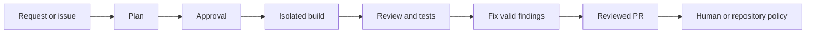

import { Card, CardGrid, LinkCard } from "@astrojs/starlight/components";

## What Alfred does

Alfred coordinates authenticated Claude Code and Codex CLIs as short-lived
engineering roles. A planner scopes work. A developer implements it in an
isolated git worktree. Separate roles review the diff and add tests. The result
is a pull request with evidence that a person can inspect.

The host operating system schedules each run. GitHub stores the shared work
state. Alfred keeps local run events, lessons, and reliability data under
`ALFRED_HOME`.

Alfred does not replace a coding harness or proxy model traffic. It adds the
workflow, memory, isolation, and approval controls needed to operate several
harness sessions as one supervised team.

## Core guarantees

<CardGrid>
  <Card title="Short-lived runs" icon="refresh">
    `launchd` on macOS or `systemd --user` on Linux starts each firing. No central orchestration loop must stay alive.
  </Card>
  <Card title="Worktree separation" icon="puzzle">
    Roles that change or review code use dedicated git worktrees, with locks and recovery around the lifecycle.
  </Card>
  <Card title="Explicit approval" icon="approve-check-circle">
    Planned work waits at the configured gate. Alfred does not merge its own PRs by default.
  </Card>
  <Card title="Independent review" icon="document">
    The agent that reviews a change is separate from the agent that wrote it.
  </Card>
  <Card title="Local memory" icon="setting">
    Embedded SQLite recalls reviewed lessons. FleetBrain stores local operations, review, and reliability data.
  </Card>
  <Card title="Inspectable evidence" icon="information">
    Run events, checks, review findings, and PR verification remain available for inspection.
  </Card>
</CardGrid>

## What ships

- Claude Code and Codex engine routing with authentication and readiness checks.
- Stable roles for planning, architecture, implementation, review, testing,
  fixes, triage, end-to-end checks, and operations.
- Single-repository and approved multi-repository planning flows.
- GitHub issue claiming, branch and worktree management, PR creation, review,
  and follow-up handling.
- Embedded SQLite recalled-lesson memory and the FleetBrain operational ledger.
- Built-in output compaction, structure-first reads, memory budgeting, and
  blast-radius context.
- A pinned codebase-memory MCP battery, plus opt-in memory, compression, vector,
  and graph integrations.
- CLI, loopback API, browser interface, Tauri desktop app, and optional Slack
  collaboration.
- macOS `launchd` and Linux `systemd --user` deployment.

## Start here

<LinkCard
  title="Install Alfred"
  description="Use the packaged desktop app or install the headless runtime on a Mac or Linux host."
  href="/getting-started/install/"
/>

<LinkCard
  title="Run the demo"
  description="Exercise plan, approval, build, review, fix, and verification in a temporary repository."
  href="https://github.com/luminik-io/alfred/blob/main/docs/DEMO.md"
/>

<LinkCard
  title="Choose a workspace pattern"
  description="Configure a single repository, a multi-repository product, or a plan-led workflow."
  href="/getting-started/workspace-patterns/"
/>

<LinkCard
  title="Set up with a coding agent"
  description="Use a bounded setup prompt with explicit repositories and no guessed credentials."
  href="/getting-started/ai-assisted-install/"
/>

<LinkCard
  title="Read the architecture"
  description="Understand scheduling, worktrees, role boundaries, state, and external services."
  href="/concepts/architecture/"
/>

<LinkCard
  title="Review the threat model"
  description="Check repository scope, network use, credentials, approvals, and containment limits."
  href="https://github.com/luminik-io/alfred/blob/main/docs/THREAT_MODEL.md"
/>

## Product boundaries

- One operator or small team, one trusted host, one local configuration.
- Local harness authentication, not a hosted model gateway.
- Explicit repository scope for scheduling and indexing. This is not a
  filesystem or network sandbox.
- Short-lived scheduled processes, not an always-running orchestrator.
- Human or repository-policy merge authority by default.
- Optional integrations must be removable and must preserve user-owned config.

Alfred runs with the local user's permissions. Use a dedicated user, virtual
machine, or container when other files or network destinations must be outside
the agent boundary.

Read the [roadmap](/about/roadmap/) for active harness, evidence, memory, and
launch work. Read the [changelog](/about/changelog/) for shipped changes.

## Status

Release tags and package downloads are on
[GitHub Releases](https://github.com/luminik-io/alfred/releases). Claude Code
and Codex are the validated execution engines. OpenCode and other harnesses
remain evaluation work until they pass the same authentication, permission,
isolation, and event-contract checks.

License: [MIT](https://github.com/luminik-io/alfred/blob/main/LICENSE).
